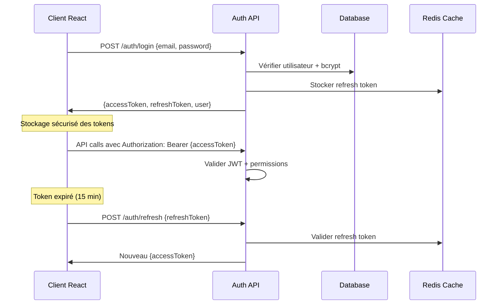
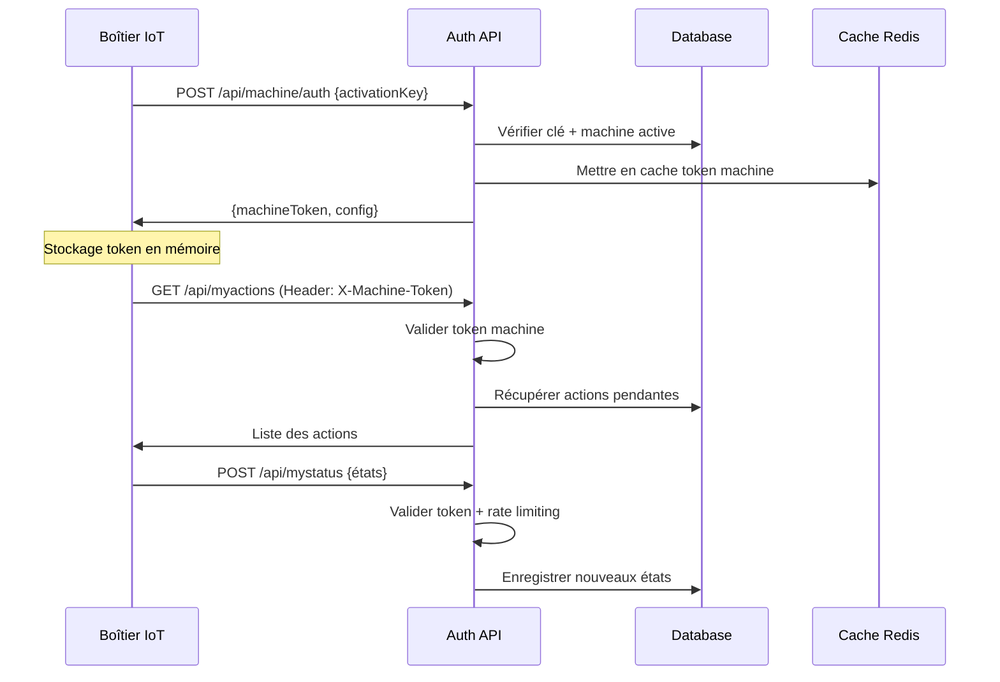

# Document de Conception - Plan de Migration Essensys

## Vue d'Ensemble

Ce document présente la conception détaillée du plan de migration pour transformer l'application web domotique Essensys legacy (ASP.NET MVC 4) vers une architecture moderne React/Node.js. L'objectif est de créer une documentation complète et un plan d'action structuré qui guidera la future équipe de développement dans cette migration complexe.

Le système Essensys actuel gère des boîtiers IoT domestiques via une interface web, permettant le contrôle du chauffage, des volets, des alarmes et autres équipements connectés. La migration vise à moderniser cette plateforme tout en préservant la compatibilité avec l'écosystème hardware existant.

## Architecture

### Architecture Actuelle (Legacy)

L'analyse du code révèle une architecture ASP.NET MVC classique :

**Couche Présentation:**
- ASP.NET MVC 4 avec Razor Views
- jQuery pour les interactions client
- CSS personnalisé pour le styling
- Gestion de session côté serveur

**Couche Métier:**
- Services métier dans `Essensys.Service`
- Logique de contrôle des appareils (chauffage, volets, alarmes)
- Gestion des actions et synchronisation d'état
- Services de notification (SMS, Email)

**Couche Données:**
- NHibernate comme ORM
- Base de données SQL Server
- Repositories pour l'accès aux données
- Gestion des versions firmware

**APIs Externes:**
- Endpoints REST pour communication avec boîtiers
- Authentification par clé machine
- Protocoles de synchronisation d'état

### Architecture Cible (Moderne)

**Frontend React/TypeScript:**
```
src/
├── components/          # Composants réutilisables
│   ├── common/         # Composants génériques
│   ├── device/         # Composants spécifiques aux appareils
│   └── auth/           # Composants d'authentification
├── pages/              # Pages principales
│   ├── Dashboard/      # Tableau de bord principal
│   ├── DeviceControl/  # Contrôle des appareils
│   └── Settings/       # Configuration utilisateur
├── hooks/              # Custom React hooks
├── services/           # Services API
├── store/              # State management (Redux Toolkit)
├── types/              # Définitions TypeScript
└── utils/              # Utilitaires
```

**Backend Node.js/Express:**
```
src/
├── controllers/        # Contrôleurs REST
├── services/          # Logique métier
├── models/            # Modèles de données
├── middleware/        # Middlewares Express
├── routes/            # Définition des routes
├── config/            # Configuration
└── utils/             # Utilitaires
```

**Base de Données:**
- PostgreSQL comme SGBD principal
- Prisma comme ORM moderne
- Migrations versionnées
- Indexation optimisée

## Composants et Interfaces

### Composants Frontend Principaux

**1. Dashboard Component**
- Affichage temps réel du statut des appareils
- Graphiques de consommation énergétique
- Alertes et notifications
- Navigation rapide vers les contrôles

**2. DeviceControl Components**
- HeatingControl : Gestion du chauffage par zones
- ShutterControl : Contrôle des volets
- AlarmControl : Gestion du système d'alarme
- GenericDeviceControl : Contrôle générique extensible

**3. Authentication Components**
- LoginForm : Formulaire de connexion
- RegisterForm : Inscription avec validation clé
- PasswordReset : Réinitialisation mot de passe
- UserProfile : Gestion du profil utilisateur

### Services Backend Principaux

**1. AuthService**
- Authentification JWT
- Gestion des sessions
- Validation des clés d'activation
- Gestion des rôles et permissions

**2. DeviceService**
- Communication avec boîtiers IoT
- Gestion de la file d'actions
- Synchronisation d'état
- Gestion des timeouts et retry

**3. NotificationService**
- Envoi SMS via API moderne
- Notifications email avec templates
- Push notifications web
- Gestion des préférences utilisateur

**4. FirmwareService**
- Gestion des versions firmware
- Distribution des mises à jour
- Suivi des déploiements
- Rollback automatique

### Authentification et Autorisation

#### Mécanismes d'Authentification Legacy

**Authentification Utilisateurs Humains (Legacy):**
```csharp
// Dans AccountController.cs
string password = HashHelper.GetHash(model.Password, HashHelper.HashType.SHA1);
if (new UserService().LoginIsValid(model.Mail, password))
{
    FormsAuthentication.SetAuthCookie(model.Mail, model.RememberMe);
    // Session côté serveur avec objet User complet
    Session["User"] = user;
}
```

**Authentification Boîtiers IoT (Legacy):**
```csharp
// Dans EssensysAuthorizeAttribute.cs
[EssensysAuthorize()]
public class MyActionsController : ApiController
{
    // Authentification par clé machine dans Session["Machine"]
    EsMachine m = HttpContext.Current.Session["Machine"] as EsMachine;
}
```

Le système legacy utilise :
- **Utilisateurs**: Hash SHA1 + Sessions ASP.NET + Forms Authentication
- **Boîtiers**: Clé d'activation (32 caractères) stockée en session serveur
- **Validation**: Clé hashée comparée à `HashedPkey` en base de données

#### Architecture d'Authentification Moderne

**1. Authentification Utilisateurs Humains**

```typescript
// Service d'authentification JWT
interface AuthService {
  // Connexion avec email/mot de passe
  login(email: string, password: string): Promise<AuthResult>;
  
  // Rafraîchissement du token
  refreshToken(refreshToken: string): Promise<AuthResult>;
  
  // Déconnexion (invalidation des tokens)
  logout(refreshToken: string): Promise<void>;
  
  // Validation du token JWT
  validateToken(token: string): Promise<UserPayload>;
}

interface AuthResult {
  accessToken: string;    // JWT court (15 min)
  refreshToken: string;   // Token long (30 jours)
  user: UserProfile;
  expiresIn: number;
}

interface UserPayload {
  userId: string;
  email: string;
  roles: string[];
  machineIds: string[];   // Machines accessibles
  permissions: Permission[];
}
```

**Flux d'Authentification Utilisateur:**


**2. Authentification Boîtiers IoT**

```typescript
// Service d'authentification machine
interface MachineAuthService {
  // Authentification par clé d'activation
  authenticateMachine(activationKey: string): Promise<MachineAuthResult>;
  
  // Validation du token machine
  validateMachineToken(token: string): Promise<MachinePayload>;
  
  // Renouvellement automatique
  renewMachineToken(machineId: string): Promise<string>;
}

interface MachineAuthResult {
  machineToken: string;   // JWT longue durée (24h)
  machineId: string;
  serialNumber: string;
  permissions: string[];
}

interface MachinePayload {
  machineId: string;
  serialNumber: string;
  firmwareVersion: string;
  lastConnection: Date;
  allowedEndpoints: string[];
}
```

**Flux d'Authentification Boîtier:**


#### Sécurité et Gestion des Clés

**Génération des Clés d'Activation:**
```typescript
// Générateur de clés sécurisées
class ActivationKeyGenerator {
  static generateKey(): string {
    // 32 caractères: 8 groupes de 4 caractères
    // Format: XXXX-XXXX-XXXX-XXXX-XXXX-XXXX-XXXX-XXXX
    const chars = 'ABCDEFGHIJKLMNOPQRSTUVWXYZ0123456789';
    let key = '';
    for (let i = 0; i < 32; i++) {
      if (i > 0 && i % 4 === 0) key += '-';
      key += chars[Math.floor(Math.random() * chars.length)];
    }
    return key;
  }
  
  static validateKeyFormat(key: string): boolean {
    return /^[A-Z0-9]{4}-[A-Z0-9]{4}-[A-Z0-9]{4}-[A-Z0-9]{4}-[A-Z0-9]{4}-[A-Z0-9]{4}-[A-Z0-9]{4}-[A-Z0-9]{4}$/.test(key);
  }
}
```

**Hashage et Validation:**
```typescript
// Service de cryptographie
class CryptoService {
  // Hash des mots de passe utilisateur (bcrypt)
  static async hashPassword(password: string): Promise<string> {
    return bcrypt.hash(password, 12);
  }
  
  static async verifyPassword(password: string, hash: string): Promise<boolean> {
    return bcrypt.compare(password, hash);
  }
  
  // Hash des clés d'activation (SHA-256 + salt)
  static hashActivationKey(key: string, salt: string): string {
    return crypto.createHash('sha256').update(key + salt).digest('hex');
  }
  
  // Génération de tokens JWT
  static generateJWT(payload: any, secret: string, expiresIn: string): string {
    return jwt.sign(payload, secret, { expiresIn, algorithm: 'HS256' });
  }
}
```

#### Middleware d'Autorisation

**Middleware Utilisateur:**
```typescript
// Middleware d'authentification utilisateur
export const authenticateUser = async (req: Request, res: Response, next: NextFunction) => {
  try {
    const token = req.headers.authorization?.replace('Bearer ', '');
    if (!token) {
      return res.status(401).json({ error: 'Token manquant' });
    }
    
    const payload = jwt.verify(token, process.env.JWT_SECRET!) as UserPayload;
    
    // Vérifier que l'utilisateur existe toujours
    const user = await userService.findById(payload.userId);
    if (!user || !user.isActive) {
      return res.status(401).json({ error: 'Utilisateur invalide' });
    }
    
    req.user = payload;
    next();
  } catch (error) {
    return res.status(401).json({ error: 'Token invalide' });
  }
};

// Middleware d'autorisation par machine
export const authorizeMachine = (machineId: string) => {
  return (req: Request, res: Response, next: NextFunction) => {
    if (!req.user?.machineIds.includes(machineId)) {
      return res.status(403).json({ error: 'Accès non autorisé à cette machine' });
    }
    next();
  };
};
```

**Middleware Boîtier:**
```typescript
// Middleware d'authentification boîtier
export const authenticateMachine = async (req: Request, res: Response, next: NextFunction) => {
  try {
    const token = req.headers['x-machine-token'] as string;
    if (!token) {
      return res.status(401).json({ error: 'Token machine manquant' });
    }
    
    const payload = jwt.verify(token, process.env.MACHINE_JWT_SECRET!) as MachinePayload;
    
    // Vérifier que la machine existe et est active
    const machine = await machineService.findById(payload.machineId);
    if (!machine || !machine.isActive) {
      return res.status(401).json({ error: 'Machine invalide' });
    }
    
    // Mettre à jour la dernière connexion
    await machineService.updateLastConnection(payload.machineId);
    
    req.machine = payload;
    next();
  } catch (error) {
    return res.status(401).json({ error: 'Token machine invalide' });
  }
};

// Rate limiting spécifique aux boîtiers
export const rateLimitMachine = rateLimit({
  windowMs: 60 * 1000, // 1 minute
  max: 60, // 60 requêtes par minute par machine
  keyGenerator: (req) => req.machine?.machineId || req.ip,
  message: 'Trop de requêtes de cette machine'
});
```

#### Gestion des Sessions et Tokens

**Configuration JWT:**
```typescript
// Configuration des tokens
const JWT_CONFIG = {
  // Tokens utilisateur
  USER_ACCESS_TOKEN_EXPIRY: '15m',
  USER_REFRESH_TOKEN_EXPIRY: '30d',
  
  // Tokens machine (plus longs car moins de risque)
  MACHINE_TOKEN_EXPIRY: '24h',
  
  // Secrets (différents pour utilisateurs et machines)
  USER_JWT_SECRET: process.env.USER_JWT_SECRET,
  MACHINE_JWT_SECRET: process.env.MACHINE_JWT_SECRET,
  
  // Algorithme de signature
  ALGORITHM: 'HS256'
};
```

**Stockage des Refresh Tokens:**
```typescript
// Service de gestion des refresh tokens
class RefreshTokenService {
  // Stocker un refresh token (Redis avec expiration)
  static async storeRefreshToken(userId: string, token: string, deviceInfo: any): Promise<void> {
    const key = `refresh_token:${userId}:${crypto.createHash('sha256').update(token).digest('hex')}`;
    await redis.setex(key, 30 * 24 * 60 * 60, JSON.stringify({
      userId,
      deviceInfo,
      createdAt: new Date()
    }));
  }
  
  // Valider un refresh token
  static async validateRefreshToken(token: string): Promise<any> {
    const hash = crypto.createHash('sha256').update(token).digest('hex');
    const keys = await redis.keys(`refresh_token:*:${hash}`);
    
    if (keys.length === 0) {
      throw new Error('Refresh token invalide');
    }
    
    const data = await redis.get(keys[0]);
    return JSON.parse(data!);
  }
  
  // Révoquer tous les tokens d'un utilisateur
  static async revokeUserTokens(userId: string): Promise<void> {
    const keys = await redis.keys(`refresh_token:${userId}:*`);
    if (keys.length > 0) {
      await redis.del(...keys);
    }
  }
}
```

#### Migration de l'Authentification

**Stratégie de Migration:**

1. **Phase 1 - Coexistence:**
   - Maintenir l'authentification legacy pour les boîtiers existants
   - Implémenter la nouvelle authentification pour les nouveaux clients
   - Proxy d'authentification pour router selon le type de client

2. **Phase 2 - Migration Progressive:**
   - Mise à jour firmware des boîtiers pour supporter JWT
   - Migration des utilisateurs vers bcrypt (lors de leur prochaine connexion)
   - Invalidation progressive des sessions legacy

3. **Phase 3 - Finalisation:**
   - Suppression du code d'authentification legacy
   - Nettoyage des tables de sessions ASP.NET
   - Audit de sécurité complet

**Script de Migration des Mots de Passe:**
```sql
-- Marquer les mots de passe à migrer
ALTER TABLE users ADD COLUMN password_needs_migration BOOLEAN DEFAULT true;

-- Procédure de migration lors de la connexion
CREATE OR REPLACE FUNCTION migrate_user_password(
  user_email VARCHAR(255),
  plain_password VARCHAR(255),
  legacy_hash VARCHAR(255)
) RETURNS BOOLEAN AS $$
DECLARE
  user_id UUID;
BEGIN
  -- Vérifier l'ancien hash SHA1
  IF legacy_hash = encode(digest(plain_password, 'sha1'), 'hex') THEN
    -- Mettre à jour avec bcrypt
    UPDATE users 
    SET password_hash = crypt(plain_password, gen_salt('bf', 12)),
        password_needs_migration = false
    WHERE email = user_email
    RETURNING id INTO user_id;
    
    RETURN user_id IS NOT NULL;
  END IF;
  
  RETURN FALSE;
END;
$$ LANGUAGE plpgsql;
```

## Modèles de Données

### Analyse de la Base de Données Legacy

**Tables Principales Identifiées:**

```sql
-- Table des utilisateurs
ES_USER (
  ID int PRIMARY KEY,
  MAIL varchar(255),
  PASSWORD varchar(255), -- Hash SHA1
  NOM varchar(255),
  PRENOM varchar(255),
  ADR1 varchar(255),
  ADR2 varchar(255),
  CP varchar(5),
  VILLE varchar(255),
  PHONE varchar(20),
  QUESTION varchar(255),
  REPONSE varchar(255), -- Hash SHA1
  SENDINFOS bit,
  PKEY varchar(255),
  ISVALID bit,
  OBSOLETE bit,
  DATECREATION datetime,
  DATECLOTURE datetime,
  LASTACCESS datetime,
  GUID varchar(255),
  MACHINE_ID int FOREIGN KEY
)

-- Table des machines/boîtiers
ES_MACHINE (
  ID int PRIMARY KEY,
  NOSERIE varchar(255),
  VERSION varchar(255),
  PKEY varchar(255), -- Clé d'activation 32 caractères
  HASHEDPKEY varchar(255),
  DATECREATION datetime,
  DATEMODIFICATION datetime,
  ISACTIVE bit,
  AUTORISEALARME bit
)

-- Table des actions à exécuter
ES_ACTION (
  ID int PRIMARY KEY,
  DATECREATION datetime,
  GUID varchar(255),
  ISDONE bit,
  ACTIONTYPE varchar(50), -- ALARME, CHAUFFAGE, VOLET, etc.
  ACTIONINFO varchar(max),
  MACHINE_ID int FOREIGN KEY
)

-- Table des index d'actions (paramètres)
ES_ACTIONINDEX (
  ID int PRIMARY KEY,
  ACTION_ID int FOREIGN KEY,
  DATAINDEX_ID int FOREIGN KEY,
  VALUE varchar(255)
)

-- Table des états des appareils
ES_STATE (
  ID int PRIMARY KEY,
  MACHINE_ID int FOREIGN KEY,
  DATECREATION datetime,
  VERSION varchar(255)
)

-- Table des index d'états (valeurs des capteurs)
ES_STATEINDEX (
  ID int PRIMARY KEY,
  STATE_ID int FOREIGN KEY,
  DATAINDEX_ID int FOREIGN KEY,
  VALUE varchar(255)
)

-- Table des définitions d'index (mapping des capteurs/actionneurs)
ES_DATAINDEX (
  ID int PRIMARY KEY,
  INDEXKEY varchar(10), -- Ex: "920" pour état BP1, "407" pour alarme
  DESCRIPTION varchar(255),
  CATEGORY varchar(50)
)

-- Table des versions firmware
ES_VERSION (
  ID int PRIMARY KEY,
  DESCRIPTIF varchar(255),
  FILENAME varchar(255),
  SIZE int
)

-- Table du suivi des mises à jour
ES_VERSIONMACHINE (
  ID int PRIMARY KEY,
  MACHINE_ID int FOREIGN KEY,
  DATEACTION datetime,
  VERSION varchar(255),
  ISOK bit,
  LASTINDEXCALL int
)

-- Table des téléphones pour SMS
ES_PHONE (
  ID int PRIMARY KEY,
  USER_ID int FOREIGN KEY,
  PHONE varchar(20),
  NOM varchar(255),
  SENDMAIL bit
)

-- Table des envois SMS
ES_SMSSEND (
  ID int PRIMARY KEY,
  PHONE_ID int FOREIGN KEY,
  DATESEND datetime,
  MESSAGE varchar(160)
)

-- Table des clés d'activation
ES_CLEMACHINE (
  ID int PRIMARY KEY,
  CLE varchar(255), -- Clé d'activation produit
  MACHINE_ID int FOREIGN KEY -- NULL si pas encore associée
)
```

### Schéma de Base de Données Moderne (PostgreSQL)

**Script d'Initialisation:**

```sql
-- Extensions PostgreSQL
CREATE EXTENSION IF NOT EXISTS "uuid-ossp";
CREATE EXTENSION IF NOT EXISTS "pgcrypto";

-- Table des utilisateurs modernisée
CREATE TABLE users (
  id UUID PRIMARY KEY DEFAULT uuid_generate_v4(),
  email VARCHAR(255) UNIQUE NOT NULL,
  password_hash VARCHAR(255) NOT NULL, -- bcrypt au lieu de SHA1
  first_name VARCHAR(255) NOT NULL,
  last_name VARCHAR(255) NOT NULL,
  address_line1 VARCHAR(255) NOT NULL,
  address_line2 VARCHAR(255),
  postal_code VARCHAR(10) NOT NULL,
  city VARCHAR(255) NOT NULL,
  phone VARCHAR(20),
  security_question VARCHAR(255) NOT NULL,
  security_answer_hash VARCHAR(255) NOT NULL,
  marketing_consent BOOLEAN DEFAULT false,
  is_active BOOLEAN DEFAULT true,
  email_verified BOOLEAN DEFAULT false,
  created_at TIMESTAMP WITH TIME ZONE DEFAULT NOW(),
  updated_at TIMESTAMP WITH TIME ZONE DEFAULT NOW(),
  last_login TIMESTAMP WITH TIME ZONE,
  
  -- Index pour performance
  CONSTRAINT users_email_check CHECK (email ~* '^[A-Za-z0-9._%+-]+@[A-Za-z0-9.-]+\.[A-Za-z]{2,}$')
);

-- Table des machines/boîtiers modernisée
CREATE TABLE machines (
  id UUID PRIMARY KEY DEFAULT uuid_generate_v4(),
  serial_number VARCHAR(255) UNIQUE NOT NULL,
  activation_key VARCHAR(32) UNIQUE NOT NULL, -- Clé d'activation
  activation_key_hash VARCHAR(255) NOT NULL,
  firmware_version VARCHAR(50) DEFAULT 'V0',
  is_active BOOLEAN DEFAULT true,
  alarm_enabled BOOLEAN DEFAULT false,
  timezone VARCHAR(50) DEFAULT 'Europe/Paris',
  created_at TIMESTAMP WITH TIME ZONE DEFAULT NOW(),
  updated_at TIMESTAMP WITH TIME ZONE DEFAULT NOW(),
  last_connection TIMESTAMP WITH TIME ZONE,
  
  -- Métadonnées pour monitoring
  connection_count INTEGER DEFAULT 0,
  last_ip_address INET,
  hardware_revision VARCHAR(20)
);

-- Table de liaison utilisateurs-machines (relation many-to-many)
CREATE TABLE user_machines (
  id UUID PRIMARY KEY DEFAULT uuid_generate_v4(),
  user_id UUID NOT NULL REFERENCES users(id) ON DELETE CASCADE,
  machine_id UUID NOT NULL REFERENCES machines(id) ON DELETE CASCADE,
  role VARCHAR(20) DEFAULT 'user', -- 'owner', 'user', 'guest'
  permissions JSONB DEFAULT '{}',
  created_at TIMESTAMP WITH TIME ZONE DEFAULT NOW(),
  
  UNIQUE(user_id, machine_id)
);

-- Table des types d'appareils
CREATE TABLE device_types (
  id UUID PRIMARY KEY DEFAULT uuid_generate_v4(),
  name VARCHAR(100) UNIQUE NOT NULL, -- 'heating', 'shutter', 'alarm', etc.
  display_name VARCHAR(255) NOT NULL,
  category VARCHAR(50) NOT NULL, -- 'climate', 'security', 'comfort'
  icon VARCHAR(100),
  config_schema JSONB, -- Schema JSON pour la configuration
  created_at TIMESTAMP WITH TIME ZONE DEFAULT NOW()
);

-- Table des appareils/zones
CREATE TABLE devices (
  id UUID PRIMARY KEY DEFAULT uuid_generate_v4(),
  machine_id UUID NOT NULL REFERENCES machines(id) ON DELETE CASCADE,
  device_type_id UUID NOT NULL REFERENCES device_types(id),
  name VARCHAR(255) NOT NULL,
  zone VARCHAR(100), -- 'living_room', 'bedroom1', etc.
  config JSONB DEFAULT '{}',
  is_active BOOLEAN DEFAULT true,
  created_at TIMESTAMP WITH TIME ZONE DEFAULT NOW(),
  updated_at TIMESTAMP WITH TIME ZONE DEFAULT NOW()
);

-- Table des actions modernisée
CREATE TABLE actions (
  id UUID PRIMARY KEY DEFAULT uuid_generate_v4(),
  machine_id UUID NOT NULL REFERENCES machines(id) ON DELETE CASCADE,
  device_id UUID REFERENCES devices(id) ON DELETE CASCADE,
  action_type VARCHAR(50) NOT NULL, -- 'set_temperature', 'open_shutter', etc.
  payload JSONB NOT NULL, -- Paramètres de l'action en JSON
  status VARCHAR(20) DEFAULT 'pending', -- 'pending', 'sent', 'executed', 'failed'
  priority INTEGER DEFAULT 5, -- 1=urgent, 5=normal, 10=low
  created_at TIMESTAMP WITH TIME ZONE DEFAULT NOW(),
  sent_at TIMESTAMP WITH TIME ZONE,
  executed_at TIMESTAMP WITH TIME ZONE,
  retry_count INTEGER DEFAULT 0,
  max_retries INTEGER DEFAULT 3,
  error_message TEXT,
  
  -- Index pour performance
  INDEX idx_actions_machine_status (machine_id, status),
  INDEX idx_actions_created_at (created_at)
);

-- Table des états des appareils
CREATE TABLE device_states (
  id UUID PRIMARY KEY DEFAULT uuid_generate_v4(),
  device_id UUID NOT NULL REFERENCES devices(id) ON DELETE CASCADE,
  state_data JSONB NOT NULL, -- État complet de l'appareil
  timestamp TIMESTAMP WITH TIME ZONE DEFAULT NOW(),
  
  -- Index pour performance et requêtes temporelles
  INDEX idx_device_states_device_time (device_id, timestamp DESC),
  INDEX idx_device_states_timestamp (timestamp)
);

-- Table des versions firmware
CREATE TABLE firmware_versions (
  id UUID PRIMARY KEY DEFAULT uuid_generate_v4(),
  version_number INTEGER UNIQUE NOT NULL,
  version_name VARCHAR(50) NOT NULL, -- 'V1', 'V2', etc.
  description TEXT,
  filename VARCHAR(255) NOT NULL,
  file_size BIGINT NOT NULL,
  checksum VARCHAR(64) NOT NULL, -- SHA-256
  is_active BOOLEAN DEFAULT true,
  min_hardware_revision VARCHAR(20),
  created_at TIMESTAMP WITH TIME ZONE DEFAULT NOW(),
  
  INDEX idx_firmware_version_number (version_number DESC)
);

-- Table du suivi des mises à jour firmware
CREATE TABLE firmware_deployments (
  id UUID PRIMARY KEY DEFAULT uuid_generate_v4(),
  machine_id UUID NOT NULL REFERENCES machines(id) ON DELETE CASCADE,
  firmware_version_id UUID NOT NULL REFERENCES firmware_versions(id),
  status VARCHAR(20) DEFAULT 'initiated', -- 'initiated', 'downloading', 'installing', 'completed', 'failed'
  progress_percentage INTEGER DEFAULT 0,
  started_at TIMESTAMP WITH TIME ZONE DEFAULT NOW(),
  completed_at TIMESTAMP WITH TIME ZONE,
  error_message TEXT,
  
  INDEX idx_deployments_machine_status (machine_id, status)
);

-- Table des contacts pour notifications
CREATE TABLE notification_contacts (
  id UUID PRIMARY KEY DEFAULT uuid_generate_v4(),
  user_id UUID NOT NULL REFERENCES users(id) ON DELETE CASCADE,
  type VARCHAR(20) NOT NULL, -- 'sms', 'email', 'push'
  contact_value VARCHAR(255) NOT NULL, -- numéro de téléphone, email, token push
  display_name VARCHAR(255),
  is_verified BOOLEAN DEFAULT false,
  is_active BOOLEAN DEFAULT true,
  preferences JSONB DEFAULT '{}', -- préférences de notification
  created_at TIMESTAMP WITH TIME ZONE DEFAULT NOW()
);

-- Table des notifications envoyées
CREATE TABLE notifications (
  id UUID PRIMARY KEY DEFAULT uuid_generate_v4(),
  contact_id UUID NOT NULL REFERENCES notification_contacts(id) ON DELETE CASCADE,
  type VARCHAR(20) NOT NULL,
  subject VARCHAR(255),
  message TEXT NOT NULL,
  status VARCHAR(20) DEFAULT 'pending', -- 'pending', 'sent', 'delivered', 'failed'
  sent_at TIMESTAMP WITH TIME ZONE,
  delivered_at TIMESTAMP WITH TIME ZONE,
  error_message TEXT,
  
  INDEX idx_notifications_contact_status (contact_id, status),
  INDEX idx_notifications_sent_at (sent_at)
);

-- Table des clés d'activation produit
CREATE TABLE product_keys (
  id UUID PRIMARY KEY DEFAULT uuid_generate_v4(),
  activation_key VARCHAR(32) UNIQUE NOT NULL,
  product_type VARCHAR(50) NOT NULL,
  is_used BOOLEAN DEFAULT false,
  machine_id UUID REFERENCES machines(id) ON DELETE SET NULL,
  created_at TIMESTAMP WITH TIME ZONE DEFAULT NOW(),
  used_at TIMESTAMP WITH TIME ZONE
);

-- Table des sessions utilisateur (pour JWT refresh tokens)
CREATE TABLE user_sessions (
  id UUID PRIMARY KEY DEFAULT uuid_generate_v4(),
  user_id UUID NOT NULL REFERENCES users(id) ON DELETE CASCADE,
  refresh_token_hash VARCHAR(255) NOT NULL,
  device_info JSONB, -- User agent, IP, etc.
  expires_at TIMESTAMP WITH TIME ZONE NOT NULL,
  created_at TIMESTAMP WITH TIME ZONE DEFAULT NOW(),
  last_used_at TIMESTAMP WITH TIME ZONE DEFAULT NOW(),
  
  INDEX idx_sessions_user_expires (user_id, expires_at),
  INDEX idx_sessions_token_hash (refresh_token_hash)
);

-- Table d'audit pour traçabilité
CREATE TABLE audit_logs (
  id UUID PRIMARY KEY DEFAULT uuid_generate_v4(),
  user_id UUID REFERENCES users(id) ON DELETE SET NULL,
  machine_id UUID REFERENCES machines(id) ON DELETE SET NULL,
  action VARCHAR(100) NOT NULL,
  resource_type VARCHAR(50),
  resource_id UUID,
  old_values JSONB,
  new_values JSONB,
  ip_address INET,
  user_agent TEXT,
  timestamp TIMESTAMP WITH TIME ZONE DEFAULT NOW(),
  
  INDEX idx_audit_user_timestamp (user_id, timestamp DESC),
  INDEX idx_audit_machine_timestamp (machine_id, timestamp DESC),
  INDEX idx_audit_timestamp (timestamp DESC)
);

-- Triggers pour updated_at automatique
CREATE OR REPLACE FUNCTION update_updated_at_column()
RETURNS TRIGGER AS $$
BEGIN
  NEW.updated_at = NOW();
  RETURN NEW;
END;
$$ language 'plpgsql';

CREATE TRIGGER update_users_updated_at BEFORE UPDATE ON users
  FOR EACH ROW EXECUTE FUNCTION update_updated_at_column();

CREATE TRIGGER update_machines_updated_at BEFORE UPDATE ON machines
  FOR EACH ROW EXECUTE FUNCTION update_updated_at_column();

CREATE TRIGGER update_devices_updated_at BEFORE UPDATE ON devices
  FOR EACH ROW EXECUTE FUNCTION update_updated_at_column();

-- Données de référence pour les types d'appareils
INSERT INTO device_types (name, display_name, category, config_schema) VALUES
('heating_zone', 'Zone de Chauffage', 'climate', '{"type": "object", "properties": {"target_temperature": {"type": "number"}, "mode": {"type": "string", "enum": ["off", "eco", "comfort", "auto"]}}}'),
('shutter', 'Volet Roulant', 'comfort', '{"type": "object", "properties": {"position": {"type": "number", "minimum": 0, "maximum": 100}}}'),
('alarm_system', 'Système d\'Alarme', 'security', '{"type": "object", "properties": {"armed": {"type": "boolean"}, "zones": {"type": "array", "items": {"type": "string"}}}}'),
('water_heater', 'Chauffe-eau', 'climate', '{"type": "object", "properties": {"mode": {"type": "string", "enum": ["off", "eco", "comfort", "auto"]}, "temperature": {"type": "number"}}}');
```

### Modèles TypeScript Correspondants

```typescript
// Modèles principaux
interface User {
  id: string;
  email: string;
  firstName: string;
  lastName: string;
  address: {
    line1: string;
    line2?: string;
    postalCode: string;
    city: string;
  };
  phone?: string;
  securityQuestion: string;
  isActive: boolean;
  emailVerified: boolean;
  createdAt: Date;
  updatedAt: Date;
  lastLogin?: Date;
  machines: UserMachine[];
}

interface Machine {
  id: string;
  serialNumber: string;
  activationKey: string;
  firmwareVersion: string;
  isActive: boolean;
  alarmEnabled: boolean;
  timezone: string;
  createdAt: Date;
  updatedAt: Date;
  lastConnection?: Date;
  connectionCount: number;
  lastIpAddress?: string;
  hardwareRevision?: string;
  devices: Device[];
}

interface Device {
  id: string;
  machineId: string;
  deviceType: DeviceType;
  name: string;
  zone?: string;
  config: Record<string, any>;
  isActive: boolean;
  createdAt: Date;
  updatedAt: Date;
  currentState?: DeviceState;
}

interface Action {
  id: string;
  machineId: string;
  deviceId?: string;
  actionType: string;
  payload: Record<string, any>;
  status: ActionStatus;
  priority: number;
  createdAt: Date;
  sentAt?: Date;
  executedAt?: Date;
  retryCount: number;
  maxRetries: number;
  errorMessage?: string;
}

type ActionStatus = 'pending' | 'sent' | 'executed' | 'failed';
type DeviceCategory = 'climate' | 'security' | 'comfort';
type UserRole = 'owner' | 'user' | 'guest';
```

### Scripts de Migration des Données

**Script de Migration Principal:**

```sql
-- Migration des utilisateurs
INSERT INTO users (
  id, email, password_hash, first_name, last_name,
  address_line1, address_line2, postal_code, city, phone,
  security_question, security_answer_hash, marketing_consent,
  is_active, created_at, last_login
)
SELECT 
  uuid_generate_v4(),
  LOWER(TRIM(MAIL)),
  PASSWORD, -- Sera re-hashé en bcrypt
  TRIM(PRENOM),
  TRIM(NOM),
  TRIM(ADR1),
  NULLIF(TRIM(ADR2), ''),
  CP,
  TRIM(VILLE),
  NULLIF(TRIM(PHONE), ''),
  TRIM(QUESTION),
  REPONSE, -- Sera re-hashé
  COALESCE(SENDINFOS, false),
  COALESCE(ISVALID, false) AND NOT COALESCE(OBSOLETE, false),
  COALESCE(DATECREATION, NOW()),
  NULLIF(LASTACCESS, '1900-01-01')
FROM ES_USER
WHERE MAIL IS NOT NULL AND TRIM(MAIL) != '';

-- Migration des machines
INSERT INTO machines (
  id, serial_number, activation_key, activation_key_hash,
  firmware_version, is_active, alarm_enabled,
  created_at, updated_at
)
SELECT 
  uuid_generate_v4(),
  COALESCE(NOSERIE, 'UNKNOWN_' || ID::text),
  PKEY,
  COALESCE(HASHEDPKEY, crypt(PKEY, gen_salt('bf'))),
  COALESCE(VERSION, 'V0'),
  COALESCE(ISACTIVE, true),
  COALESCE(AUTORISEALARME, false),
  COALESCE(DATECREATION, NOW()),
  COALESCE(DATEMODIFICATION, NOW())
FROM ES_MACHINE
WHERE PKEY IS NOT NULL;

-- Liaison utilisateurs-machines
INSERT INTO user_machines (user_id, machine_id, role)
SELECT 
  u.id,
  m.id,
  'owner'
FROM users u
JOIN ES_USER eu ON u.email = LOWER(TRIM(eu.MAIL))
JOIN ES_MACHINE em ON eu.MACHINE_ID = em.ID
JOIN machines m ON m.activation_key = em.PKEY;
```

### Relations de Données

- **Users ↔ Machines**: Relation many-to-many via `user_machines` avec rôles
- **Machines → Devices**: Relation one-to-many, une machine contient plusieurs appareils
- **Devices → DeviceStates**: Relation one-to-many pour l'historique des états
- **Machines → Actions**: Relation one-to-many pour les commandes en attente
- **Users → NotificationContacts**: Relation one-to-many pour les moyens de contact
- **Machines → FirmwareDeployments**: Relation one-to-many pour le suivi des mises à jour

### Index et Performance

**Index Principaux:**
- `users(email)` - UNIQUE pour authentification rapide
- `machines(activation_key)` - UNIQUE pour activation
- `actions(machine_id, status)` - Composite pour requêtes fréquentes
- `device_states(device_id, timestamp DESC)` - Pour historique temporel
- `audit_logs(timestamp DESC)` - Pour requêtes d'audit chronologiques

**Partitioning Strategy:**
- `device_states` partitionnée par mois pour gérer le volume
- `audit_logs` partitionnée par trimestre
- `notifications` avec rétention automatique (6 mois)

## Correctness Properties

*Une propriété est une caractéristique ou un comportement qui doit être vrai dans toutes les exécutions valides d'un système - essentiellement, une déclaration formelle sur ce que le système doit faire. Les propriétés servent de pont entre les spécifications lisibles par l'homme et les garanties de correction vérifiables par machine.*

**Propriété 1: Complétude de l'analyse du code legacy**
*Pour tout* projet de code legacy analysé, tous les fichiers de contrôleurs, modèles DTO et services métier doivent être catalogués et documentés dans l'analyse
**Valide: Exigences 1.1**

**Propriété 2: Complétude de l'inventaire des dépendances**
*Pour tout* fichier de configuration (packages.config, web.config, références de projet), toutes les dépendances externes doivent être répertoriées dans le catalogue des dépendances
**Valide: Exigences 1.2**

**Propriété 3: Documentation complète des APIs**
*Pour tout* contrôleur API dans le code legacy, tous les endpoints et leurs signatures doivent être documentés avec leurs formats de données
**Valide: Exigences 1.4**

**Propriété 4: Calcul des métriques de complexité**
*Pour tout* fichier de code source, des métriques de complexité cyclomatique doivent être calculées et les zones à risque identifiées
**Valide: Exigences 1.5**

**Propriété 5: Spécification complète de l'architecture frontend**
*Pour toute* architecture React cible, les éléments suivants doivent être spécifiés : structure des composants, patterns de state management, et configuration TypeScript
**Valide: Exigences 2.1**

**Propriété 6: Spécification complète de l'architecture backend**
*Pour toute* architecture Node.js/Express cible, les patterns API RESTful, la gestion des middlewares et la structure des services doivent être définis
**Valide: Exigences 2.2**

**Propriété 7: Spécification complète du schéma de base de données**
*Pour tout* schéma de base de données moderne, toutes les tables, relations et contraintes doivent être spécifiées avec leurs types et index
**Valide: Exigences 2.3**

**Propriété 8: Décomposition en features autonomes**
*Pour toute* roadmap d'implémentation, le projet doit être décomposé en features indépendantes avec des priorités assignées
**Valide: Exigences 3.1**

**Propriété 9: Estimation d'effort pour chaque feature**
*Pour toute* feature identifiée dans la roadmap, une estimation détaillée en jours-homme doit être fournie
**Valide: Exigences 3.2**

**Propriété 10: Documentation des dépendances entre features**
*Pour toute* paire de features dans la roadmap, les dépendances et prérequis doivent être spécifiés si ils existent
**Valide: Exigences 3.3**

**Propriété 11: Mapping complet des données legacy**
*Pour toute* table de la base de données legacy, un mapping vers le nouveau schéma doit être défini avec les transformations nécessaires
**Valide: Exigences 4.1**

**Propriété 12: Scripts de migration pour chaque table**
*Pour toute* table à migrer, des scripts de transformation et de validation des données doivent être fournis
**Valide: Exigences 4.2**

**Propriété 13: Complétude du guide de développement**
*Pour tout* guide de développement, les conventions de code, patterns architecturaux et bonnes pratiques doivent être spécifiés pour chaque couche
**Valide: Exigences 5.1**

**Propriété 14: Exemples d'implémentation par couche**
*Pour toute* couche architecturale (frontend, backend, données), des exemples concrets d'implémentation doivent être fournis
**Valide: Exigences 5.2**

**Propriété 15: Scénarios de test par feature métier**
*Pour toute* feature métier identifiée, des scénarios de test fonctionnels doivent être définis
**Valide: Exigences 6.1**

**Propriété 16: Critères de performance définis**
*Pour tout* système cible, des benchmarks et critères de performance acceptables doivent être spécifiés
**Valide: Exigences 6.2**

**Propriété 17: Chiffrage complet des coûts**
*Pour tout* projet de migration, les coûts de développement, infrastructure et formation doivent être chiffrés
**Valide: Exigences 8.1**

**Propriété 18: Quantification des bénéfices**
*Pour tout* système modernisé, les gains en maintenabilité, performance et évolutivité doivent être quantifiés
**Valide: Exigences 8.2**

## Gestion d'Erreur

### Stratégies de Gestion d'Erreur

**Frontend:**
- Error Boundaries React pour capturer les erreurs de composants
- Gestion centralisée des erreurs API via intercepteurs Axios
- Notifications utilisateur avec toast/snackbar
- Fallback UI pour les composants critiques
- Retry automatique pour les requêtes réseau

**Backend:**
- Middleware global de gestion d'erreur Express
- Logging structuré avec Winston
- Codes d'erreur standardisés
- Validation des données d'entrée avec Joi/Zod
- Circuit breaker pour les services externes

**Communication Boîtiers:**
- Retry exponentiel pour les communications échouées
- Timeout configurables par type d'opération
- Queue de messages avec persistance
- Détection de déconnexion et reconnexion automatique
- Fallback vers mode dégradé

### Codes d'Erreur Standardisés

```typescript
enum ErrorCodes {
  // Authentification
  AUTH_INVALID_CREDENTIALS = 'AUTH_001',
  AUTH_TOKEN_EXPIRED = 'AUTH_002',
  AUTH_INSUFFICIENT_PERMISSIONS = 'AUTH_003',
  
  // Appareils
  DEVICE_NOT_FOUND = 'DEV_001',
  DEVICE_OFFLINE = 'DEV_002',
  DEVICE_COMMAND_FAILED = 'DEV_003',
  
  // Données
  DATA_VALIDATION_ERROR = 'DATA_001',
  DATA_INTEGRITY_ERROR = 'DATA_002',
  
  // Système
  SYSTEM_MAINTENANCE = 'SYS_001',
  SYSTEM_OVERLOAD = 'SYS_002'
}
```

## Stratégie de Tests

### Tests Unitaires
- **Frontend:** Jest + React Testing Library
- **Backend:** Jest + Supertest
- Couverture de code minimum : 80%
- Tests des composants React isolés
- Tests des services métier
- Mocking des dépendances externes

### Tests d'Intégration
- Tests API end-to-end avec base de données de test
- Tests de communication avec boîtiers simulés
- Tests de migration de données
- Tests de performance avec charge simulée

### Tests de Compatibilité
- Validation des endpoints legacy avec boîtiers existants
- Tests de régression sur les protocoles de communication
- Validation des formats de données échangés
- Tests de montée de version progressive

### Tests Property-Based
- Utilisation de fast-check pour JavaScript/TypeScript
- Tests de propriétés sur les transformations de données
- Validation des invariants métier
- Tests de cohérence des états système

### Framework de Tests Recommandé
- **Frontend:** Jest, React Testing Library, Cypress (E2E)
- **Backend:** Jest, Supertest, Artillery (performance)
- **Property-Based:** fast-check
- **API:** Postman/Newman pour tests automatisés
- **Base de données:** Testcontainers pour isolation

### Métriques de Qualité
- Couverture de code : minimum 80%
- Temps d'exécution des tests : < 10 minutes
- Taux de réussite : > 95% en continu
- Performance : temps de réponse < 200ms pour 95% des requêtes

### Interfaces API

#### Endpoints d'Authentification

**Authentification Utilisateurs:**
```typescript
// Connexion utilisateur
POST /api/auth/login
Content-Type: application/json
{
  "email": "user@example.com",
  "password": "motdepasse",
  "rememberMe": true
}
Response: {
  "accessToken": "eyJhbGciOiJIUzI1NiIs...",
  "refreshToken": "eyJhbGciOiJIUzI1NiIs...",
  "user": { "id": "uuid", "email": "...", "firstName": "..." },
  "expiresIn": 900
}

// Rafraîchissement de token
POST /api/auth/refresh
Content-Type: application/json
{
  "refreshToken": "eyJhbGciOiJIUzI1NiIs..."
}

// Inscription utilisateur
POST /api/auth/register
Content-Type: application/json
{
  "email": "user@example.com",
  "password": "motdepasse",
  "firstName": "Jean",
  "lastName": "Dupont",
  "activationKey": "XXXX-XXXX-XXXX-XXXX-XXXX-XXXX-XXXX-XXXX",
  "address": { "line1": "...", "postalCode": "...", "city": "..." }
}

// Déconnexion
POST /api/auth/logout
Authorization: Bearer {accessToken}
Content-Type: application/json
{
  "refreshToken": "eyJhbGciOiJIUzI1NiIs..."
}
```

**Authentification Boîtiers:**
```typescript
// Authentification machine
POST /api/machine/auth
Content-Type: application/json
{
  "activationKey": "XXXX-XXXX-XXXX-XXXX-XXXX-XXXX-XXXX-XXXX",
  "serialNumber": "ESS001234",
  "firmwareVersion": "V15"
}
Response: {
  "machineToken": "eyJhbGciOiJIUzI1NiIs...",
  "machineId": "uuid",
  "config": { "pollInterval": 30, "maxRetries": 3 }
}

// Renouvellement token machine (automatique)
POST /api/machine/renew
X-Machine-Token: eyJhbGciOiJIUzI1NiIs...
```

#### Endpoints Utilisateur

```typescript
// Profil utilisateur
GET /api/user/profile
Authorization: Bearer {accessToken}
Response: {
  "id": "uuid",
  "email": "user@example.com",
  "firstName": "Jean",
  "lastName": "Dupont",
  "machines": [
    {
      "id": "uuid",
      "name": "Maison Principale",
      "role": "owner",
      "lastConnection": "2024-01-15T10:30:00Z"
    }
  ]
}

// Mise à jour profil
PUT /api/user/profile
Authorization: Bearer {accessToken}
Content-Type: application/json
{
  "firstName": "Jean",
  "lastName": "Martin",
  "phone": "+33123456789"
}

// Changement de mot de passe
POST /api/user/change-password
Authorization: Bearer {accessToken}
Content-Type: application/json
{
  "currentPassword": "ancien",
  "newPassword": "nouveau"
}

// Réinitialisation mot de passe
POST /api/user/reset-password
Content-Type: application/json
{
  "email": "user@example.com"
}

// Validation réinitialisation
POST /api/user/reset-password/confirm
Content-Type: application/json
{
  "token": "reset-token",
  "newPassword": "nouveau-mot-de-passe"
}
```

#### Endpoints Appareils (Interface Utilisateur)

```typescript
// Liste des appareils d'une machine
GET /api/machines/{machineId}/devices
Authorization: Bearer {accessToken}
Response: [
  {
    "id": "uuid",
    "name": "Chauffage Salon",
    "type": "heating_zone",
    "zone": "living_room",
    "status": "online",
    "currentState": {
      "temperature": 21.5,
      "targetTemperature": 22.0,
      "mode": "comfort"
    },
    "lastUpdate": "2024-01-15T10:30:00Z"
  }
]

// Envoyer une commande à un appareil
POST /api/devices/{deviceId}/actions
Authorization: Bearer {accessToken}
Content-Type: application/json
{
  "actionType": "set_temperature",
  "payload": {
    "targetTemperature": 23.0,
    "mode": "comfort"
  }
}
Response: {
  "actionId": "uuid",
  "status": "pending",
  "estimatedExecutionTime": "2024-01-15T10:31:00Z"
}

// Statut d'un appareil
GET /api/devices/{deviceId}/status
Authorization: Bearer {accessToken}
Response: {
  "deviceId": "uuid",
  "status": "online",
  "currentState": { "temperature": 21.5, "mode": "comfort" },
  "lastUpdate": "2024-01-15T10:30:00Z",
  "pendingActions": [
    {
      "id": "uuid",
      "type": "set_temperature",
      "status": "pending",
      "createdAt": "2024-01-15T10:30:30Z"
    }
  ]
}

// Configuration d'un appareil
PUT /api/devices/{deviceId}/config
Authorization: Bearer {accessToken}
Content-Type: application/json
{
  "name": "Chauffage Salon",
  "zone": "living_room",
  "config": {
    "minTemperature": 15,
    "maxTemperature": 25,
    "ecoTemperature": 19
  }
}
```

#### Endpoints Boîtiers IoT (Compatibilité Legacy)

```typescript
// Récupération des actions à exécuter (compatible legacy)
GET /api/myactions
X-Machine-Token: eyJhbGciOiJIUzI1NiIs...
Response: {
  "_de67f": {
    "guid": "action-guid",
    "obl": "ALARMEON_20240115_103000"
  },
  "actions": [
    {
      "guid": "action-guid-2",
      "infos": [
        { "key": "920", "value": "1" },
        { "key": "407", "value": "1" }
      ]
    }
  ]
}

// Envoi du statut des appareils (compatible legacy)
POST /api/mystatus
X-Machine-Token: eyJhbGciOiJIUzI1NiIs...
Content-Type: application/json
{
  "ek": [
    { "key": "920", "value": "0" },
    { "key": "407", "value": "1" },
    { "key": "100", "value": "21.5" }
  ],
  "version": "V15"
}
Response: HTTP 201 Created

// Informations serveur (compatible legacy)
GET /api/serverinfos
X-Machine-Token: eyJhbGciOiJIUzI1NiIs...
Response: {
  "isconnected": true,
  "infos": [
    { "key": "920", "description": "État BP1" },
    { "key": "407", "description": "Alarme Accès Distance" }
  ],
  "newversion": "V16"
}

// Confirmation d'exécution d'action
POST /api/done/{actionGuid}
X-Machine-Token: eyJhbGciOiJIUzI1NiIs...
Response: HTTP 200 OK
```

#### Endpoints de Gestion des Versions

```typescript
// Vérification de nouvelle version
GET /api/firmware/check
X-Machine-Token: eyJhbGciOiJIUzI1NiIs...
Response: {
  "hasUpdate": true,
  "currentVersion": "V15",
  "latestVersion": "V16",
  "updateInfo": {
    "description": "Amélioration de la stabilité",
    "size": 2048576,
    "mandatory": false
  }
}

// Téléchargement de firmware
GET /api/firmware/download/{version}
X-Machine-Token: eyJhbGciOiJIUzI1NiIs...
Response: Binary firmware file

// Rapport de progression de mise à jour
POST /api/firmware/progress
X-Machine-Token: eyJhbGciOiJIUzI1NiIs...
Content-Type: application/json
{
  "version": "V16",
  "progress": 75,
  "status": "installing"
}

// Confirmation de mise à jour
POST /api/firmware/complete
X-Machine-Token: eyJhbGciOiJIUzI1NiIs...
Content-Type: application/json
{
  "version": "V16",
  "success": true,
  "bootTime": "2024-01-15T10:35:00Z"
}
```

#### Endpoints de Notifications

```typescript
// Configuration des notifications utilisateur
GET /api/user/notifications/settings
Authorization: Bearer {accessToken}
Response: {
  "contacts": [
    {
      "id": "uuid",
      "type": "sms",
      "value": "+33123456789",
      "verified": true,
      "preferences": {
        "alarms": true,
        "maintenance": false,
        "updates": true
      }
    }
  ]
}

// Ajout d'un contact de notification
POST /api/user/notifications/contacts
Authorization: Bearer {accessToken}
Content-Type: application/json
{
  "type": "sms",
  "value": "+33123456789",
  "displayName": "Mon téléphone"
}

// Test d'envoi de notification
POST /api/user/notifications/test
Authorization: Bearer {accessToken}
Content-Type: application/json
{
  "contactId": "uuid",
  "message": "Test de notification Essensys"
}
```

#### Codes de Réponse HTTP Standardisés

```typescript
// Codes de succès
200 OK              // Opération réussie
201 Created         // Ressource créée
204 No Content      // Opération réussie sans contenu

// Codes d'erreur client
400 Bad Request     // Données invalides
401 Unauthorized    // Authentification requise
403 Forbidden       // Accès interdit
404 Not Found       // Ressource non trouvée
409 Conflict        // Conflit (ex: email déjà utilisé)
422 Unprocessable   // Validation échouée
429 Too Many Requests // Rate limiting

// Codes d'erreur serveur
500 Internal Server Error // Erreur serveur
502 Bad Gateway          // Service externe indisponible
503 Service Unavailable  // Maintenance
```