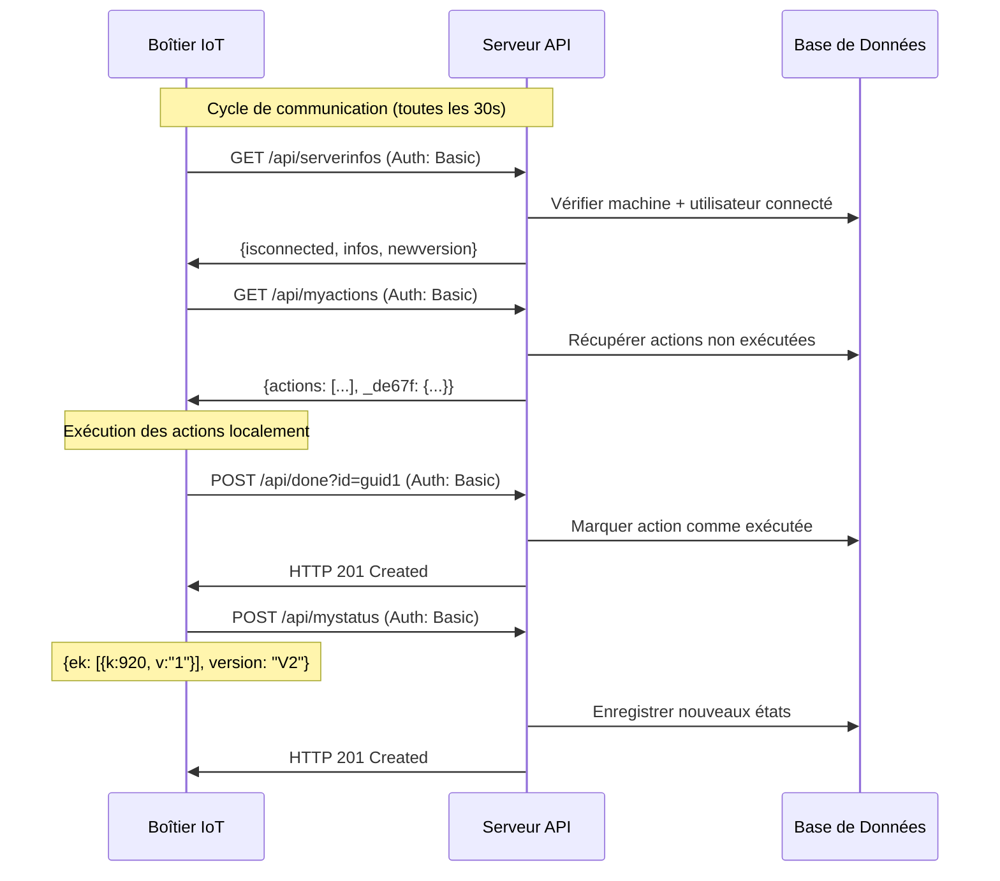
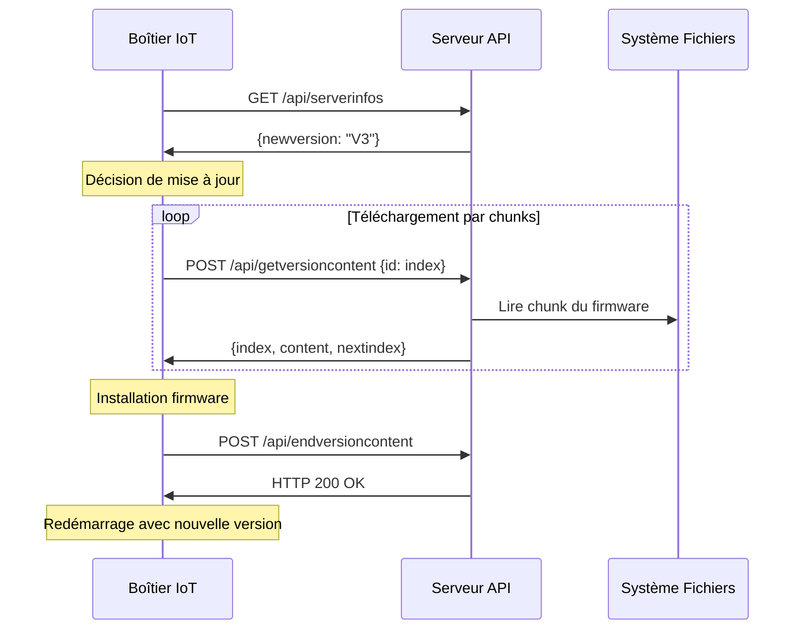

# Analyse Complète du Système Legacy Essensys

## Vue d'Ensemble

Cette analyse détaille l'architecture, les composants et les patterns de l'application web domotique Essensys legacy basée sur ASP.NET MVC 4 (.NET Framework 4.0). Le système gère des boîtiers IoT domestiques via une interface web permettant le contrôle du chauffage, des volets, des alarmes et autres équipements connectés.

## 1. Architecture Générale

### Pattern Architectural Principal
- **Architecture en couches** : Présentation (MVC) → Services Métier → Accès aux Données (Repository/DAO)
- **Pattern Repository** : Abstraction de l'accès aux données avec NHibernate
- **Pattern Service Layer** : Logique métier encapsulée dans des services spécialisés
- **Pattern DTO/Entity** : Séparation entre objets de transfert et entités métier

### Structure des Projets

```
Essensys.Web.UI/          # Interface utilisateur MVC
├── Controllers/          # Contrôleurs MVC et API
├── Views/               # Vues Razor
├── Scripts/             # JavaScript (jQuery)
└── Content/             # CSS et ressources

Essensys.Service/         # Couche services métier
├── Fonctions/           # Services par domaine fonctionnel
├── Security/            # Authentification et autorisation
├── Transaction/         # Services transactionnels
├── Phone/               # Services de notification SMS
└── Response/            # DTOs de réponse API

Essensys.Repository/      # Couche d'accès aux données
├── DTO/                 # Entités de données
└── DAO/                 # Repositories d'accès

Essensys.Common/          # Utilitaires partagés
```

## 2. Contrôleurs et Endpoints

### Contrôleurs Web (Interface Utilisateur)

#### AccountController.cs
**Responsabilité** : Gestion des comptes utilisateurs
- `Login()` : Authentification utilisateur avec SHA1
- `Register()` : Inscription avec validation de clé produit
- `UpdateMyInfos()` : Modification du profil utilisateur
- `ValidateAccount()` : Activation de compte par email
- `LostPassword()` : Réinitialisation de mot de passe

**Patterns identifiés** :
- Authentification par Forms Authentication
- Stockage utilisateur en Session["User"]
- Validation côté serveur avec ModelState
- Hash SHA1 pour les mots de passe (obsolète)

#### HomeController.cs
**Responsabilité** : Interface principale de contrôle
- `Index()` : Tableau de bord principal
- `DoActions()` : Exécution d'actions sur les appareils
- `WaitBox()` : Attente de synchronisation avec boîtier
- `WaitActions()` : Attente d'exécution des actions
- `InitVersion()` : Lancement de mise à jour firmware

**Patterns identifiés** :
- Polling JavaScript pour synchronisation temps réel
- Actions asynchrones avec JsonResult
- Gestion d'état complexe avec timeouts
- Logique métier mélangée dans le contrôleur

### Contrôleurs API (Communication Boîtiers)

#### MyActionsController.cs
**Endpoint** : `GET /api/myactions`
**Responsabilité** : Récupération des actions à exécuter par le boîtier
- Authentification par attribut `[EssensysAuthorize]`
- Retourne les actions en attente pour la machine
- Format de réponse structuré avec `EsActionsInfo`

#### MyStatusController.cs
**Endpoint** : `POST /api/mystatus`
**Responsabilité** : Réception des états du boîtier
- Enregistrement des états des capteurs/actionneurs
- Validation des données avec `EsStatusMessage`
- Gestion d'erreurs avec codes HTTP appropriés

**Autres endpoints API** :
- `ServerInfosController` : Informations serveur
- `GetVersionContentController` : Téléchargement firmware
- `EndVersionContentController` : Fin de téléchargement
- `DoneController` : Acquittement d'actions

## 3. Modèles de Données (DTOs)

### Entités Principales

#### EsUser.cs
**Représente** : Compte utilisateur
```csharp
- Id : int (Identifiant)
- Mail : string (Email avec validation)
- Password : string (Hash SHA1)
- Nom, Prenom : string (Identité)
- Adr1, Adr2, Cp, Ville : string (Adresse)
- Phone : string (Téléphone)
- Question, Reponse : string (Sécurité)
- Pkey : string (Clé d'activation)
- Machine : EsMachine (Relation 1:1)
```

#### EsMachine.cs
**Représente** : Boîtier IoT
```csharp
- Id : int (Identifiant)
- NoSerie : string (Numéro de série)
- Version : string (Version firmware)
- Pkey : string (Clé d'activation 32 chars)
- HashedPkey : string (Clé hashée MD5)
- IsActive : bool (État actif)
- AutoriseAlarme : bool (Autorisation alarme)
```

#### EsAction.cs
**Représente** : Action à exécuter
```csharp
- Id : int (Identifiant)
- Guid : string (Identifiant unique)
- ActionType : string (Type : CHAUFFAGE, VOLET, ALARME)
- ActionInfo : string (Description)
- IsDone : bool (État d'exécution)
- Machine : EsMachine (Boîtier cible)
- Indexes : IList<EsActionIndex> (Paramètres)
```

#### EsState.cs
**Représente** : État du boîtier
```csharp
- Id : int (Identifiant)
- Version : string (Version firmware)
- StateDate : DateTime (Horodatage)
- Machine : EsMachine (Boîtier source)
```

### Patterns de Mapping
- **FluentNHibernate** : Mapping objet-relationnel
- **Fichiers Map séparés** : Configuration de mapping externalisée
- **Interface IEsObject** : Contrat commun pour toutes les entités

## 4. Services Métier

### Services par Domaine Fonctionnel

#### ChauffageService.cs
**Responsabilité** : Gestion du chauffage par zones
```csharp
RegisterAction(machine, mode, zone)
- Zones : "zj" (jour), "zn" (nuit), "sdb1", "sdb2"
- Modes : Configuration via index de données
```

#### AlarmeService.cs
**Responsabilité** : Système d'alarme
- Activation/désactivation alarme
- Gestion des codes d'accès
- Notifications SMS en cas d'intrusion

#### VoletService.cs / StoreService.cs
**Responsabilité** : Contrôle des volets et stores
- Ouverture/fermeture par pourcentage
- Gestion des groupes de volets
- Programmation horaire

### Services Transactionnels

#### ActionService.cs
**Responsabilité** : Gestion des actions
```csharp
- RegisterAction() : Création d'actions
- ListActions() : Récupération pour boîtier
- AcquitAction() : Acquittement d'exécution
- UndoAllActions() : Annulation en cas d'erreur
```

#### StateService.cs
**Responsabilité** : Gestion des états
```csharp
- RegisterState() : Enregistrement état boîtier
- GetLastCall() : Dernière communication
- HasRefreshed() : Test de synchronisation
- AllActionsOK() : Vérification exécution
```

#### UserService.cs
**Responsabilité** : Gestion utilisateurs
```csharp
- LoginIsValid() : Authentification
- RegisterUser() : Inscription
- ValidateAPIAccess() : Auth boîtiers
- GenerateNewPassword() : Récupération mot de passe
```

### Services de Communication

#### PhoneService.cs
**Responsabilité** : Notifications SMS
- Envoi SMS via API externe
- Gestion des quotas mensuels
- Historique des envois

#### EMailSender.cs
**Responsabilité** : Notifications email
- Templates HTML
- Confirmation d'inscription
- Alertes système

## 5. Authentification et Sécurité

### Mécanisme d'Authentification Utilisateurs
```csharp
// Hash SHA1 (obsolète)
string password = HashHelper.GetHash(model.Password, HashHelper.HashType.SHA1);

// Forms Authentication
FormsAuthentication.SetAuthCookie(model.Mail, model.RememberMe);

// Session utilisateur
Session["User"] = user;
```

### Authentification Boîtiers IoT
```csharp
[EssensysAuthorize()]
public class MyActionsController : ApiController
{
    // Récupération machine depuis session
    EsMachine m = HttpContext.Current.Session["Machine"] as EsMachine;
}
```

**Processus d'authentification boîtier** :
1. Clé d'activation 32 caractères générée
2. Hash MD5 stocké en base (`HashedPkey`)
3. Validation par comparaison de hash
4. Stockage machine en session serveur

### Vulnérabilités Identifiées
- **SHA1** : Algorithme de hash obsolète et vulnérable
- **MD5** : Hash faible pour les clés d'activation
- **Sessions serveur** : Non scalable, perte en cas de redémarrage
- **Pas de JWT** : Authentification stateful uniquement
- **Pas de HTTPS forcé** : Communications potentiellement non chiffrées

## 6. Communication avec Boîtiers IoT

### Protocole de Communication
1. **Authentification** : Clé d'activation hashée
2. **Polling** : Boîtier interroge `/api/myactions` régulièrement
3. **Actions** : Récupération des commandes à exécuter
4. **États** : Envoi périodique via `/api/mystatus`
5. **Acquittement** : Confirmation d'exécution via `/api/done`

### Format des Données
```csharp
// Actions vers boîtier
EsActionsInfo {
    actions: List<EsActionInfo>
    _de67f: EsAlarmAction (alarme spéciale)
}

// États depuis boîtier
EsStatusMessage {
    ek: List<EsKeyValue> (états capteurs)
    version: string (version firmware)
}
```

### Index de Données
**Système de mapping** : Index numériques pour capteurs/actionneurs
- `920` : État bouton poussoir 1
- `407` : Alarme accès distance
- `Chauf_zj_Mode` : Mode chauffage zone jour
- Etc.

## 7. Gestion des Versions Firmware

### Processus de Mise à Jour
1. **Détection** : Comparaison version boîtier vs serveur
2. **Téléchargement** : Streaming du firmware via API
3. **Installation** : Suivi du progrès par étapes
4. **Validation** : Confirmation de succès/échec

### Suivi des Déploiements
```csharp
EsVersionMachine {
    Machine: EsMachine
    Version: string
    IsOk: bool (succès/échec)
    Dateaction: DateTime
    LastIndexCall: int (progression)
}
```

## 8. Patterns et Anti-Patterns Identifiés

### Patterns Positifs
- **Repository Pattern** : Abstraction accès données
- **Service Layer** : Logique métier encapsulée
- **DTO Pattern** : Séparation entités/transfert
- **Factory Pattern** : `EsSessionFactory` pour NHibernate

### Anti-Patterns et Problèmes
- **God Controller** : `HomeController` trop complexe
- **Anemic Domain Model** : DTOs sans logique métier
- **Magic Numbers** : Index de données codés en dur
- **Mixed Concerns** : Logique métier dans contrôleurs
- **Global State** : Utilisation excessive des sessions
- **Polling** : Communication inefficace avec boîtiers
- **Synchronous Waits** : `Thread.Sleep()` dans contrôleurs web

## 9. Dépendances et Technologies

### Framework et Bibliothèques
- **ASP.NET MVC 4** : Framework web
- **.NET Framework 4.0** : Runtime (obsolète)
- **NHibernate** : ORM
- **FluentNHibernate** : Configuration mapping
- **jQuery 1.7.1** : JavaScript (obsolète)
- **SQL Server** : Base de données

### Services Externes
- **SMTP** : Envoi d'emails
- **API SMS** : Notifications (Octopush)
- **Système de fichiers** : Stockage firmware

## 10. Métriques de Complexité

### Analyse Quantitative
- **Contrôleurs** : 10 classes (4 web + 6 API)
- **Services** : 15+ classes métier
- **DTOs** : 24 entités + mappings
- **Repositories** : 12 classes d'accès données
- **Lignes de code** : ~5000+ lignes estimées

### Zones de Complexité Élevée
1. **HomeController.DoActions()** : Logique complexe multi-appareils
2. **UserService** : Gestion complète du cycle de vie utilisateur
3. **ActionService** : Orchestration des actions boîtiers
4. **Authentification** : Mécanismes multiples et obsolètes

## 11. Recommandations pour la Migration

### Priorités de Modernisation
1. **Sécurité** : Remplacer SHA1/MD5 par bcrypt/JWT
2. **Architecture** : Découpler logique métier des contrôleurs
3. **Communication** : WebSockets au lieu de polling
4. **Base de données** : Migration vers PostgreSQL
5. **Frontend** : React au lieu de jQuery/Razor

### Stratégie de Migration
1. **Phase 1** : Analyse et documentation (actuelle)
2. **Phase 2** : Refactoring de l'authentification
3. **Phase 3** : Migration des APIs critiques
4. **Phase 4** : Réécriture du frontend
5. **Phase 5** : Migration complète des données

Cette analyse fournit une base solide pour planifier la migration vers une architecture moderne React/Node.js tout en préservant la compatibilité avec l'écosystème hardware existant.

## 12. Inventaire Complet des Dépendances Externes

### Dépendances NuGet (packages.config)

#### Framework ASP.NET MVC
- **Microsoft.AspNet.Mvc** v4.0.20710.0 - Framework MVC principal
- **Microsoft.AspNet.Mvc.fr** v4.0.20710.0 - Localisation française
- **Microsoft.AspNet.Razor** v2.0.20710.0 - Moteur de templates Razor
- **Microsoft.AspNet.Razor.fr** v2.0.20710.0 - Localisation française
- **Microsoft.AspNet.WebPages** v2.0.20710.0 - Pages web ASP.NET
- **Microsoft.AspNet.WebPages.fr** v2.0.20710.0 - Localisation française

#### Framework Web API
- **Microsoft.AspNet.WebApi** v4.0.20710.0 - Framework Web API
- **Microsoft.AspNet.WebApi.Client** v4.0.20710.0 - Client HTTP
- **Microsoft.AspNet.WebApi.Client.fr** v4.0.20710.0 - Localisation française
- **Microsoft.AspNet.WebApi.Core** v4.0.20710.0 - Cœur Web API
- **Microsoft.AspNet.WebApi.Core.fr** v4.0.20710.0 - Localisation française
- **Microsoft.AspNet.WebApi.WebHost** v4.0.20710.0 - Hébergement Web API
- **Microsoft.AspNet.WebApi.WebHost.fr** v4.0.20710.0 - Localisation française

#### Bibliothèques HTTP et Infrastructure
- **Microsoft.Net.Http** v2.0.20710.0 - Client HTTP .NET
- **Microsoft.Net.Http.fr** v2.0.20710.0 - Localisation française
- **Microsoft.Web.Infrastructure** v1.0.0.0 - Infrastructure web Microsoft

#### Bibliothèques JavaScript/Frontend
- **jQuery** v1.7.1.1 - Bibliothèque JavaScript (OBSOLÈTE)
- **jQuery.UI.Combined** v1.8.20.1 - Interface utilisateur jQuery (OBSOLÈTE)
- **jQuery.Validation** v1.9.0.1 - Validation côté client (OBSOLÈTE)
- **Modernizr** v2.5.3 - Détection de fonctionnalités navigateur

#### Optimisation et Build
- **Microsoft.AspNet.Web.Optimization** v1.0.0 - Bundling et minification
- **Microsoft.AspNet.Web.Optimization.fr** v1.0.0 - Localisation française
- **WebGrease** v1.1.0 - Optimisation CSS/JS

#### Sérialisation
- **Newtonsoft.Json** v4.5.6 - Sérialisation JSON (VERSION OBSOLÈTE)

### Assemblies Externes (Externals/)

#### ORM et Base de Données
- **NHibernate.dll** - ORM principal (v3.3.1.4000)
- **FluentNHibernate.dll** - Configuration fluide NHibernate
- **NHibernate.ByteCode.LinFu.dll** - Proxy dynamique pour NHibernate
- **NHibernate.Caches.SysCache.dll** - Cache système pour NHibernate
- **Iesi.Collections.dll** - Collections pour NHibernate

#### Proxy et Injection de Dépendances
- **LinFu.DynamicProxy.dll** - Génération de proxy dynamique

#### Parsing et Requêtes
- **Antlr3.Runtime.dll** - Runtime ANTLR pour parsing
- **Remotion.Data.Linq.dll** - Provider LINQ pour requêtes

#### Logging
- **log4net.dll** - Framework de logging

### Configuration des Services Externes (Web.config)

#### Base de Données
```xml
<connectionStrings>
  <add name="Essensys" 
       connectionString="Server=tcp:YOUR_SERVER.database.windows.net,1433;
                        Database=ESSENSYS;
                        User ID=YOUR_USER@YOUR_SERVER;
                        Password=YOUR_DB_PASSWORD;
                        Trusted_Connection=False;
                        Connection Timeout=30"/>
</connectionStrings>
```
- **Type** : SQL Server sur Azure
- **Serveur** : YOUR_SERVER.database.windows.net
- **Base** : ESSENSYS
- **Sécurité** : Mot de passe en clair dans config (VULNÉRABILITÉ)

#### Service SMS (Octopush)
```xml
<add key="OCTOPUSH_LOGIN" value=""/>
<add key="OCTOPUSH_APIKEY" value=""/>
<add key="OCTOPUSH_MODE" value="simu"/>
```
- **Fournisseur** : Octopush (API SMS française)
- **Mode** : Simulation (pas de vrais envois)
- **Authentification** : Login/API Key

#### Service Email (SMTP)
```xml
<add key="mailserver" value="auth.smtp.1and1.fr"/>
<add key="mailport" value="25"/>
<add key="mailuser" value="messages@essensys.fr"/>
<add key="mailpassword" value="YOUR_SMTP_PASSWORD"/>
<add key="mailreplyto" value="messages@essensys.fr"/>
```
- **Fournisseur** : 1&1 (IONOS)
- **Protocole** : SMTP non sécurisé (port 25)
- **Sécurité** : Mot de passe en clair (VULNÉRABILITÉ)

#### Service Cloud (Amazon AWS)
```xml
<add key="Amazon.Key" value="YOUR_AWS_ACCESS_KEY_ID"/>
<add key="Amazon.SecretKey" value="YOUR_AWS_SECRET_ACCESS_KEY"/>
```
- **Service** : Amazon Web Services
- **Usage** : Non déterminé dans le code analysé
- **Sécurité** : Clés en clair (VULNÉRABILITÉ CRITIQUE)

#### Stockage Fichiers
```xml
<add key="Essensys.VersionDirectory" value="C:\EBAZTEN\CLIENT_PARAM\ESSENSYS"/>
<add key="Essensys.BufferLength" value="500000"/>
```
- **Type** : Système de fichiers local
- **Usage** : Stockage des firmwares
- **Limitation** : Non scalable, dépendant du serveur

### Configuration Logging (log4net)

#### Appenders Configurés
1. **mainAppender** : Logs principaux
   - Fichier : `log\log-main.txt`
   - Rotation : Par taille (3MB max)
   - Rétention : 2 fichiers

2. **traceAppender** : Logs de trace
   - Fichier : `log\log-trace.txt`
   - Rotation : Par taille (3MB max)
   - Rétention : 2 fichiers

3. **queryAppender** : Requêtes SQL
   - Fichier : `log\log-query.txt`
   - Usage : Debug NHibernate

### Références de Projets Internes

#### Structure de Dépendances
```
Essensys.Web.UI
├── Essensys.Service (Logique métier)
├── Essensys.Repository (Accès données)
└── Essensys.Common (Utilitaires)

Essensys.Service
├── Essensys.Repository
└── Essensys.Common

Essensys.Repository
└── Essensys.Common
```

### Analyse des Vulnérabilités de Sécurité

#### Vulnérabilités Critiques
1. **Mots de passe en clair** dans Web.config
   - Base de données Azure SQL
   - Compte email SMTP
   - Clés AWS

2. **Versions obsolètes** avec failles connues
   - jQuery 1.7.1 (2012) - Multiples CVE
   - .NET Framework 4.0 (2010) - Non supporté
   - Newtonsoft.Json 4.5.6 - Failles de désérialisation

3. **Protocoles non sécurisés**
   - SMTP port 25 (non chiffré)
   - Pas de HTTPS forcé

#### Vulnérabilités Moyennes
1. **Sessions côté serveur** non sécurisées
2. **Timeout session** très court (1 minute)
3. **Pas de validation CSRF**
4. **Logs en debug** en production

### Recommandations de Migration

#### Priorité 1 - Sécurité
- Migrer vers des variables d'environnement sécurisées
- Implémenter HTTPS obligatoire
- Mettre à jour toutes les dépendances obsolètes
- Remplacer SMTP par API email sécurisée

#### Priorité 2 - Architecture
- Remplacer NHibernate par Prisma/TypeORM
- Migrer de jQuery vers React
- Implémenter JWT au lieu de sessions serveur
- Containeriser avec Docker

#### Priorité 3 - Performance
- Remplacer polling par WebSockets
- Implémenter cache Redis
- Optimiser les requêtes base de données
- CDN pour les assets statiques

### Équivalents Modernes Recommandés

| Composant Legacy | Équivalent Moderne | Justification |
|------------------|-------------------|---------------|
| ASP.NET MVC 4 | Express.js + TypeScript | Performance, écosystème |
| NHibernate | Prisma | Type-safety, migrations |
| jQuery 1.7.1 | React 18 | Composants, état |
| SQL Server | PostgreSQL | Open source, JSON |
| Forms Auth | JWT + bcrypt | Stateless, sécurisé |
| log4net | Winston/Pino | Performance, JSON |
| SMTP direct | SendGrid/Mailgun | Fiabilité, analytics |
| File storage | AWS S3/MinIO | Scalabilité, CDN |

Cette analyse des dépendances révèle un système legacy avec de nombreuses vulnérabilités de sécurité et des technologies obsolètes nécessitant une migration complète vers une stack moderne.
## 13. Documentation Complète des APIs et Protocoles de Communication

### Vue d'Ensemble du Protocole

Le système Essensys utilise un protocole de communication REST basé sur HTTP avec authentification Basic Auth pour la communication entre les boîtiers IoT et le serveur web. Le protocole suit un pattern de polling où les boîtiers interrogent régulièrement le serveur pour récupérer les actions à exécuter et envoient leurs états.

### Authentification des Boîtiers IoT

#### Mécanisme d'Authentification
```csharp
[EssensysAuthorize()]
public class MyActionsController : ApiController
```

**Protocole** : HTTP Basic Authentication
**Format** : `Authorization: Basic base64(username:password)`
**Validation** : 
- Décodage Base64 du header Authorization
- Concaténation username + password = clé d'activation hashée
- Validation contre `EsMachine.HashedPkey` en base de données
- Stockage de la machine en session serveur

**Exemple de flux d'authentification** :
```
1. Boîtier encode sa clé d'activation en Base64
2. Envoi header: Authorization: Basic <base64_key>
3. Serveur décode et valide contre base de données
4. Si valide: stockage en Session["Machine"]
5. Si invalide: HTTP 401 Unauthorized
```

### Endpoints API pour Boîtiers IoT

#### 1. GET /api/myactions
**Responsabilité** : Récupération des actions à exécuter par le boîtier
**Authentification** : Requise (`[EssensysAuthorize]`)
**Méthode** : GET
**Paramètres** : Aucun (machine identifiée par authentification)

**Réponse** :
```json
{
  "_de67f": {                    // Action alarme spéciale
    "guid": "uuid-string",
    "obl": "action-info"
  },
  "actions": [                   // Actions normales
    {
      "guid": "uuid-string",
      "params": [
        {
          "k": 123,              // Index de données (int)
          "v": "value"           // Valeur (string)
        }
      ]
    }
  ]
}
```

**Logique métier** :
- Récupération des actions non exécutées (`IsDone = false`)
- Séparation des actions alarme (type "ALARME") des autres
- Conversion des paramètres en format clé-valeur
- Retour immédiat (pas de long polling)

#### 2. POST /api/mystatus
**Responsabilité** : Réception des états du boîtier
**Authentification** : Requise (`[EssensysAuthorize]`)
**Méthode** : POST
**Content-Type** : application/json

**Corps de requête** :
```json
{
  "ek": [                        // États des capteurs/actionneurs
    {
      "k": 920,                  // Index de données
      "v": "1"                   // Valeur d'état
    },
    {
      "k": 407,
      "v": "0"
    }
  ],
  "version": "V2"                // Version firmware du boîtier
}
```

**Réponse** :
- **Succès** : HTTP 201 Created
- **Erreur** : HTTP 400 Bad Request

**Logique métier** :
- Validation de la présence du champ `ek`
- Enregistrement des états via `StateService.RegisterState()`
- Mise à jour de l'horodatage de dernière communication

#### 3. POST /api/done
**Responsabilité** : Acquittement d'exécution d'action
**Authentification** : Requise (`[EssensysAuthorize]`)
**Méthode** : POST
**Paramètres** : `id` (string) - GUID de l'action exécutée

**Exemple** :
```
POST /api/done?id=12345678-1234-1234-1234-123456789abc
```

**Réponse** :
- **Succès** : HTTP 201 Created
- **Action non trouvée** : HTTP 404 Not Found

**Logique métier** :
- Recherche de l'action par GUID et machine
- Marquage `IsDone = true`
- Gestion d'exception si action inexistante

#### 4. GET /api/serverinfos
**Responsabilité** : Informations serveur et détection de nouvelles versions
**Authentification** : Requise (`[EssensysAuthorize]`)
**Méthode** : GET

**Réponse** :
```json
{
  "isconnected": true,           // Utilisateur connecté sur interface web
  "infos": [920, 407, 123],      // Index de données supportés
  "newversion": "V3"             // Nouvelle version disponible ou "no"
}
```

**Logique métier** :
- Vérification de connexion utilisateur web
- Récupération des index de données configurés
- Détection de nouvelle version firmware
- Nettoyage des logs de version obsolètes

#### 5. POST /api/getversioncontent
**Responsabilité** : Téléchargement de firmware par chunks
**Authentification** : Requise (`[EssensysAuthorize]`)
**Méthode** : POST
**Paramètres** : `id` (int) - Index du chunk à télécharger

**Réponse** :
```json
{
  "index": 1,                    // Index actuel
  "content": "base64-data",      // Contenu du chunk en Base64
  "nextindex": 2                 // Index suivant (0 si terminé)
}
```

**Logique métier** :
- Lecture du firmware par chunks de taille fixe
- Encodage Base64 du contenu binaire
- Gestion de la progression du téléchargement

#### 6. POST /api/endversioncontent
**Responsabilité** : Confirmation de fin de téléchargement firmware
**Authentification** : Requise (`[EssensysAuthorize]`)
**Méthode** : POST

**Réponse** : HTTP 200 OK

**Logique métier** :
- Marquage de la mise à jour comme réussie
- Mise à jour du statut dans `EsVersionMachine`

### Protocole de Communication Détaillé

#### Séquence de Communication Normale


#### Séquence de Mise à Jour Firmware


### Index de Données (Mapping Capteurs/Actionneurs)

#### Index Système Identifiés
- **920** : État bouton poussoir 1 (0/1)
- **407** : Alarme accès distance (0/1)
- **Chauf_zj_Mode** : Mode chauffage zone jour
- **Chauf_zn_Mode** : Mode chauffage zone nuit
- **Chauf_zsb1_Mode** : Mode chauffage salle de bain 1
- **Chauf_zsb2_Mode** : Mode chauffage salle de bain 2

#### Format des Valeurs
- **Booléens** : "0" (false) ou "1" (true)
- **Modes** : Chaînes de caractères ("eco", "comfort", "off")
- **Pourcentages** : Valeurs numériques en string ("0" à "100")

### Gestion des Erreurs et Timeouts

#### Codes d'Erreur HTTP
- **200 OK** : Succès
- **201 Created** : Ressource créée avec succès
- **400 Bad Request** : Données invalides
- **401 Unauthorized** : Authentification échouée
- **404 Not Found** : Ressource non trouvée

#### Stratégies de Retry
- **Côté boîtier** : Retry automatique en cas d'échec réseau
- **Côté serveur** : Timeout de session courte (1 minute)
- **Actions** : Pas de TTL, restent en attente indéfiniment

#### Gestion de la Connectivité
- **Détection de déconnexion** : Absence de polling pendant > 2 minutes
- **Reconnexion** : Authentification automatique au redémarrage
- **État de synchronisation** : Vérification via `StateService.HasRefreshed()`

### Limitations et Anti-Patterns Identifiés

#### Problèmes de Scalabilité
1. **Sessions serveur** : Non scalable horizontalement
2. **Polling intensif** : Charge serveur élevée
3. **Pas de compression** : Bande passante gaspillée
4. **Pas de cache** : Requêtes répétitives

#### Problèmes de Sécurité
1. **Basic Auth** : Credentials en clair (Base64)
2. **Pas de HTTPS** : Communications non chiffrées
3. **Pas de rate limiting** : Vulnérable aux attaques DoS
4. **Sessions persistantes** : Vulnérable aux attaques de session

#### Problèmes de Fiabilité
1. **Pas de heartbeat** : Détection de panne tardive
2. **Pas de queue** : Perte d'actions en cas de panne
3. **Pas de versioning API** : Incompatibilité firmware
4. **Logs insuffisants** : Debug difficile

### Recommandations pour la Migration

#### Architecture Moderne Recommandée
1. **WebSockets** : Communication bidirectionnelle temps réel
2. **JWT** : Authentification stateless et sécurisée
3. **Message Queue** : Fiabilité des actions (Redis/RabbitMQ)
4. **API Gateway** : Rate limiting, monitoring, versioning
5. **HTTPS obligatoire** : Chiffrement des communications

#### Nouveau Protocole Proposé
```typescript
// Authentification JWT
POST /api/v2/auth/device
{
  "activationKey": "XXXX-XXXX-XXXX-XXXX",
  "deviceInfo": {...}
}
→ {accessToken: "jwt...", refreshToken: "..."}

// WebSocket connection
WSS /api/v2/device/connect?token=jwt...

// Messages bidirectionnels
{
  "type": "action",
  "id": "uuid",
  "device": "heating_zone_1",
  "command": "set_temperature",
  "params": {"temperature": 21}
}

{
  "type": "state",
  "device": "heating_zone_1", 
  "state": {"temperature": 20.5, "mode": "heating"}
}
```

Cette documentation révèle un protocole de communication fonctionnel mais obsolète nécessitant une modernisation complète pour améliorer la sécurité, la performance et la fiabilité.
## 14. Métriques de Complexité du Code Legacy

### Métriques Quantitatives Globales

#### Volume de Code
- **Total fichiers C#** : 98 fichiers
- **Total lignes de code** : 7,146 lignes
- **Moyenne par fichier** : ~73 lignes
- **Projets** : 6 projets (.csproj)

#### Répartition par Projet
```
Essensys.Web.UI/          ~2,500 lignes (35%)
├── Controllers/          ~1,800 lignes
├── App_Start/           ~200 lignes
└── Properties/          ~100 lignes

Essensys.Service/         ~2,200 lignes (31%)
├── Fonctions/           ~800 lignes
├── Transaction/         ~600 lignes
├── Security/            ~500 lignes
├── Response/            ~200 lignes
└── Phone/               ~100 lignes

Essensys.Repository/      ~1,800 lignes (25%)
├── DTO/                 ~1,200 lignes
├── DAO/                 ~400 lignes
└── Mapping/             ~200 lignes

Essensys.Common/          ~400 lignes (6%)
Essensys.Console/         ~200 lignes (3%)
Essensys.Notifier/        ~46 lignes (1%)
```

### Analyse de Complexité Cyclomatique

#### Méthodes à Complexité Élevée (CC > 10)

##### 1. HomeController.WaitBox() - CC: ~15
**Localisation** : `Essensys.Web.UI/Controllers/HomeController.cs:160-220`
**Problèmes identifiés** :
- Boucle `while` avec condition complexe
- Multiples branches `if/else` imbriquées (7 niveaux)
- Logique de timeout et retry mélangée
- Gestion d'état complexe avec version firmware
- `Thread.Sleep()` dans contrôleur web (anti-pattern)

```csharp
// Complexité élevée due aux conditions imbriquées
while (!serv.HasRefreshed(m, LastCall) && i < 40) {
    if (vm != null) {
        if (!vm.IsOk && ts.Minutes < 5) {
            // Branche 1
        } else {
            // Branche 2
        }
    } else {
        // Branche 3
    }
    if (nv) {
        if (lastsynchro.Count(...) > 0 && lastsynchro.Count(...) > 0) {
            if (EtatBP1.Value.Substring(0, 1) == "0" && AlarmeAccesDistance.Value == "1") {
                // Logique complexe
            }
        }
    }
}
```

##### 2. HomeController.DoActions() - CC: ~12
**Localisation** : `Essensys.Web.UI/Controllers/HomeController.cs:324-370`
**Problèmes identifiés** :
- 12 paramètres d'entrée (violation SRP)
- Parsing manuel des paramètres de formulaire
- Logique de synchronisation avec timeout
- Mélange de responsabilités (UI + logique métier)

```csharp
public JsonResult DoActions(bool newar, string ar, bool newal, string al, 
    string alresp, string codealarme, bool newcf, string cfzj, 
    bool newcfzn, string cfzn, bool newcfsdb1, string cfsdb1, 
    bool newcfsdb2, string cfsdb2, bool newcm, string cfcm, 
    string cfvol, string cfsto)
```

##### 3. AccountController.UpdateMyInfos() - CC: ~14
**Localisation** : `Essensys.Web.UI/Controllers/AccountController.cs:50-120`
**Problèmes identifiés** :
- Validation manuelle complexe avec multiples conditions
- Logique de mise à jour de mot de passe imbriquée
- Gestion d'erreurs avec `ModelState` répétitive
- Mélange validation + logique métier

##### 4. UserService.RegisterUser() - CC: ~8
**Localisation** : `Essensys.Service/Security/UserService.cs:180-220`
**Problèmes identifiés** :
- Logique de création machine conditionnelle
- Hash de mot de passe avec SHA1 (obsolète)
- Gestion de version firmware mélangée

##### 5. ActionService.ListActions() - CC: ~6
**Localisation** : `Essensys.Service/Transaction/ActionService.cs:35-55`
**Problèmes identifiés** :
- Boucles imbriquées pour transformation de données
- Conversion manuelle DTO → Response objects

### Métriques de Maintenabilité

#### Index de Maintenabilité par Classe

| Classe | Lignes | Méthodes | CC Moy | Maintenabilité |
|--------|--------|----------|--------|----------------|
| HomeController | 380 | 12 | 8.5 | Faible |
| AccountController | 280 | 15 | 6.2 | Moyenne |
| UserService | 320 | 18 | 4.8 | Moyenne |
| ActionService | 150 | 8 | 3.5 | Bonne |
| StateService | 200 | 10 | 4.2 | Moyenne |

#### Facteurs de Complexité Identifiés

##### 1. Couplage Fort (High Coupling)
- **Session State** : Utilisation excessive de `Session["User"]` et `Session["Machine"]`
- **Static Dependencies** : Appels directs à `new Service()` partout
- **Database Coupling** : Logique SQL mélangée dans les services

##### 2. Cohésion Faible (Low Cohesion)
- **God Controllers** : HomeController fait trop de choses différentes
- **Mixed Concerns** : Validation + logique métier + accès données mélangés
- **Utility Classes** : Classes avec méthodes non liées

##### 3. Duplication de Code (Code Duplication)
- **Validation Patterns** : Même logique de validation répétée
- **Error Handling** : Même pattern try/catch/Json partout
- **Authentication Checks** : `Session["User"] == null` répété 15+ fois

### Anti-Patterns Détectés

#### 1. God Object Pattern
**HomeController** : 380 lignes, 12 méthodes publiques
- Gestion de l'authentification
- Synchronisation avec boîtiers
- Gestion des versions firmware
- Exécution d'actions
- Interface utilisateur

#### 2. Anemic Domain Model
**DTOs sans logique** : Toutes les entités sont de simples conteneurs
```csharp
public class EsUser : IEsObject {
    public virtual string Mail { get; set; }
    public virtual string Password { get; set; }
    // Aucune logique métier, que des getters/setters
}
```

#### 3. Magic Numbers/Strings
- Index de données codés en dur : `"920"`, `"407"`
- Timeouts arbitraires : `i < 40`, `i < 20`
- Codes d'action : `"ALARME"`, `"CHAUFFAGE"`

#### 4. Primitive Obsession
- Utilisation excessive de `string` pour tout
- Pas d'énumérations pour les états
- Pas de Value Objects pour les concepts métier

#### 5. Long Parameter List
```csharp
// 12 paramètres primitifs au lieu d'un objet
DoActions(bool newar, string ar, bool newal, string al, ...)
```

### Zones à Risque Élevé

#### 1. Contrôleurs Web (Risque Critique)
- **HomeController.WaitBox()** : Logique de synchronisation complexe
- **HomeController.DoActions()** : Trop de paramètres et responsabilités
- **AccountController** : Logique d'authentification fragile

#### 2. Services de Sécurité (Risque Élevé)
- **UserService** : Hash SHA1, logique d'activation complexe
- **EssensysAuthorizeAttribute** : Authentification Basic Auth obsolète

#### 3. Gestion des États (Risque Moyen)
- **StateService** : Logique de synchronisation avec timeouts
- **ActionService** : Gestion des actions avec retry manuel

### Recommandations de Refactoring

#### Priorité 1 - Décomposition des God Objects
```csharp
// Au lieu de HomeController monolithique
public class DashboardController { }      // Interface principale
public class DeviceController { }         // Contrôle appareils  
public class FirmwareController { }       // Gestion versions
public class SyncController { }           // Synchronisation
```

#### Priorité 2 - Introduction de Value Objects
```csharp
public class ActivationKey {
    private readonly string _value;
    public ActivationKey(string value) {
        if (!IsValid(value)) throw new ArgumentException();
        _value = value;
    }
    private static bool IsValid(string key) => 
        Regex.IsMatch(key, @"^[A-Z0-9]{32}$");
}
```

#### Priorité 3 - Élimination des Magic Numbers
```csharp
public enum DeviceIndex {
    ButtonState = 920,
    AlarmRemoteAccess = 407,
    HeatingDayMode = 100,
    HeatingNightMode = 101
}
```

#### Priorité 4 - Injection de Dépendances
```csharp
public class HomeController {
    private readonly IUserService _userService;
    private readonly IActionService _actionService;
    
    public HomeController(IUserService userService, IActionService actionService) {
        _userService = userService;
        _actionService = actionService;
    }
}
```

### Métriques de Qualité Cibles

#### Objectifs Post-Migration
- **Complexité Cyclomatique** : < 5 par méthode
- **Lignes par méthode** : < 20 lignes
- **Paramètres par méthode** : < 4 paramètres
- **Couplage** : Injection de dépendances partout
- **Cohésion** : Une responsabilité par classe
- **Duplication** : < 3% de code dupliqué

Cette analyse révèle un code legacy avec une complexité élevée nécessitant un refactoring majeur pour améliorer la maintenabilité et réduire les risques techniques.