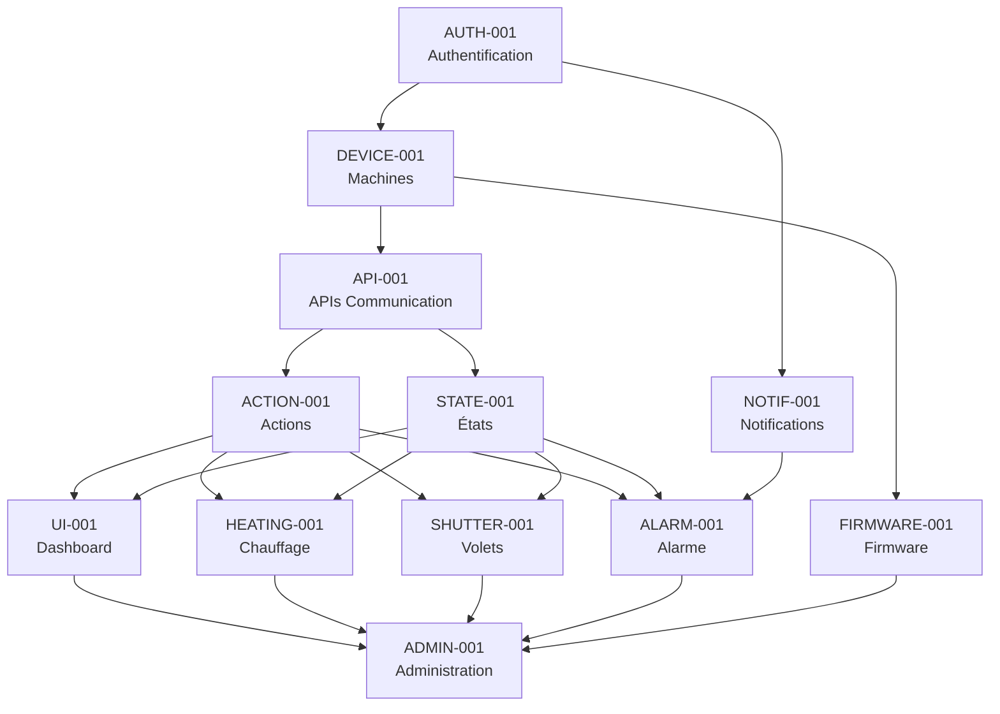

# Planification et Estimation du Projet - Migration Essensys

## 3.1 Décomposition du Projet en Features Autonomes

### Analyse des Features Métier du Système Legacy

Basé sur l'analyse complète du code legacy, voici l'identification de toutes les features métier :

#### Features Principales Identifiées

##### 1. **Gestion des Utilisateurs et Authentification**
- **Scope** : Inscription, connexion, profil utilisateur, récupération mot de passe
- **Composants legacy** : AccountController, UserService, EsUser
- **Criticité** : **CRITIQUE** - Prérequis pour toutes les autres features
- **Complexité** : Élevée (sécurité, migration des mots de passe SHA1)

##### 2. **Gestion des Machines/Boîtiers IoT**
- **Scope** : Enregistrement, activation, configuration des boîtiers
- **Composants legacy** : EsMachine, EsClemachine, clés d'activation
- **Criticité** : **CRITIQUE** - Cœur du système IoT
- **Complexité** : Élevée (protocole de communication, authentification)

##### 3. **Système de Chauffage Multi-Zones**
- **Scope** : Contrôle température par zone (jour, nuit, SDB1, SDB2)
- **Composants legacy** : ChauffageService, index de données chauffage
- **Criticité** : **HAUTE** - Feature principale pour utilisateurs
- **Complexité** : Moyenne (logique métier claire)

##### 4. **Contrôle des Volets et Stores**
- **Scope** : Ouverture/fermeture, programmation, groupes de volets
- **Composants legacy** : VoletService, StoreService, VoletAndStoreService
- **Criticité** : **HAUTE** - Feature très utilisée
- **Complexité** : Moyenne (logique similaire au chauffage)

##### 5. **Système d'Alarme**
- **Scope** : Activation/désactivation, codes d'accès, notifications
- **Composants legacy** : AlarmeService, gestion des codes
- **Criticité** : **HAUTE** - Sécurité du domicile
- **Complexité** : Élevée (sécurité, notifications temps réel)

##### 6. **Gestion des Actions et Synchronisation**
- **Scope** : Queue d'actions, exécution, acquittement, retry
- **Composants legacy** : ActionService, EsAction, EsActionIndex
- **Criticité** : **CRITIQUE** - Infrastructure de communication
- **Complexité** : Très élevée (fiabilité, gestion d'erreurs)

##### 7. **Gestion des États et Monitoring**
- **Scope** : Collecte états capteurs, historique, synchronisation
- **Composants legacy** : StateService, EsState, EsStateIndex
- **Criticité** : **CRITIQUE** - Feedback temps réel
- **Complexité** : Élevée (volume de données, performance)

##### 8. **Gestion des Versions Firmware**
- **Scope** : Détection, téléchargement, installation, rollback
- **Composants legacy** : VersionMachineService, EsVersion
- **Criticité** : **MOYENNE** - Maintenance système
- **Complexité** : Très élevée (streaming, gestion d'erreurs)

##### 9. **Notifications SMS et Email**
- **Scope** : Envoi SMS/email, templates, préférences utilisateur
- **Composants legacy** : PhoneService, EMailSender, EsPhone
- **Criticité** : **MOYENNE** - Confort utilisateur
- **Complexité** : Moyenne (intégration services tiers)

##### 10. **Dashboard et Interface Utilisateur**
- **Scope** : Tableau de bord, visualisation temps réel, contrôles
- **Composants legacy** : HomeController, vues Razor, JavaScript
- **Criticité** : **HAUTE** - Expérience utilisateur
- **Complexité** : Élevée (temps réel, UX moderne)

##### 11. **APIs de Communication Boîtiers**
- **Scope** : Endpoints REST, authentification, protocole de communication
- **Composants legacy** : MyActionsController, MyStatusController, etc.
- **Criticité** : **CRITIQUE** - Communication avec hardware
- **Complexité** : Très élevée (compatibilité, performance)

##### 12. **Administration et Configuration**
- **Scope** : Gestion des clés produit, configuration système, logs
- **Composants legacy** : Gestion des EsClemachine, configuration
- **Criticité** : **FAIBLE** - Outils d'administration
- **Complexité** : Faible (CRUD simple)

### Priorisation des Features

#### Matrice Criticité vs Dépendances

| Feature | Criticité | Dépendances | Priorité | Ordre |
|---------|-----------|-------------|----------|-------|
| Gestion Utilisateurs | CRITIQUE | Aucune | P0 | 1 |
| Gestion Machines | CRITIQUE | Utilisateurs | P0 | 2 |
| APIs Communication | CRITIQUE | Machines | P0 | 3 |
| Gestion Actions | CRITIQUE | APIs, Machines | P1 | 4 |
| Gestion États | CRITIQUE | APIs, Machines | P1 | 5 |
| Dashboard UI | HAUTE | États, Actions | P1 | 6 |
| Système Chauffage | HAUTE | Actions, États | P2 | 7 |
| Contrôle Volets | HAUTE | Actions, États | P2 | 8 |
| Système Alarme | HAUTE | Actions, États, Notifications | P2 | 9 |
| Notifications | MOYENNE | Utilisateurs | P3 | 10 |
| Gestion Firmware | MOYENNE | Machines, APIs | P3 | 11 |
| Administration | FAIBLE | Toutes | P4 | 12 |

### Features Autonomes Définies

#### Groupe 1 : Infrastructure Critique (P0)
**Features autonomes** : Peuvent être développées en parallèle après les prérequis

1. **AUTH-001 : Authentification et Utilisateurs**
   - **Autonomie** : Complètement autonome
   - **Livrables** : JWT, bcrypt, gestion profils
   - **Tests** : Authentification, sécurité

2. **DEVICE-001 : Gestion des Machines**
   - **Autonomie** : Dépend de AUTH-001
   - **Livrables** : CRUD machines, clés d'activation
   - **Tests** : Activation, configuration

3. **API-001 : APIs de Communication**
   - **Autonomie** : Dépend de DEVICE-001
   - **Livrables** : Endpoints REST, authentification boîtiers
   - **Tests** : Protocole, compatibilité

#### Groupe 2 : Moteur de Communication (P1)
**Features autonomes** : Développement parallèle possible

4. **ACTION-001 : Gestion des Actions**
   - **Autonomie** : Dépend de API-001
   - **Livrables** : Queue, exécution, retry
   - **Tests** : Fiabilité, performance

5. **STATE-001 : Gestion des États**
   - **Autonomie** : Dépend de API-001
   - **Livrables** : Collecte, stockage, historique
   - **Tests** : Volume, temps réel

6. **UI-001 : Dashboard Principal**
   - **Autonomie** : Dépend de STATE-001, ACTION-001
   - **Livrables** : Interface React, temps réel
   - **Tests** : UX, performance

#### Groupe 3 : Features Métier (P2)
**Features autonomes** : Développement complètement parallèle

7. **HEATING-001 : Système de Chauffage**
   - **Autonomie** : Complètement autonome après Groupe 2
   - **Livrables** : Contrôle multi-zones, programmation
   - **Tests** : Logique métier, intégration

8. **SHUTTER-001 : Contrôle des Volets**
   - **Autonomie** : Complètement autonome après Groupe 2
   - **Livrables** : Ouverture/fermeture, groupes
   - **Tests** : Logique métier, intégration

9. **ALARM-001 : Système d'Alarme**
   - **Autonomie** : Dépend de NOTIF-001 pour notifications
   - **Livrables** : Activation, codes, alertes
   - **Tests** : Sécurité, notifications

#### Groupe 4 : Features Complémentaires (P3-P4)
**Features autonomes** : Développement indépendant

10. **NOTIF-001 : Notifications**
    - **Autonomie** : Complètement autonome après AUTH-001
    - **Livrables** : SMS, email, push, templates
    - **Tests** : Intégration services tiers

11. **FIRMWARE-001 : Gestion Firmware**
    - **Autonomie** : Dépend de DEVICE-001, API-001
    - **Livrables** : Mise à jour, rollback, monitoring
    - **Tests** : Streaming, fiabilité

12. **ADMIN-001 : Administration**
    - **Autonomie** : Complètement autonome (dernière)
    - **Livrables** : Gestion clés, configuration, logs
    - **Tests** : CRUD, sécurité

### Matrice de Dépendances entre Features



### Critères d'Autonomie des Features

#### Définition d'une Feature Autonome
Une feature est considérée comme autonome si :

1. **Interface claire** : APIs bien définies avec les autres features
2. **Base de données isolée** : Schéma de données indépendant
3. **Tests indépendants** : Peut être testée sans les autres features
4. **Déploiement séparé** : Peut être mise en production indépendamment
5. **Équipe dédiée** : Peut être développée par une équipe séparée

#### Validation de l'Autonomie

| Feature | Interface | DB | Tests | Déploiement | Équipe | Autonome |
|---------|-----------|----|----|-------------|--------|----------|
| AUTH-001 | ✅ JWT | ✅ Users | ✅ Unitaires | ✅ Service | ✅ Oui | **OUI** |
| DEVICE-001 | ✅ REST | ✅ Machines | ✅ Unitaires | ✅ Service | ✅ Oui | **OUI** |
| API-001 | ✅ HTTP | ✅ Sessions | ✅ Intégration | ✅ Gateway | ✅ Oui | **OUI** |
| ACTION-001 | ✅ Queue | ✅ Actions | ✅ Unitaires | ✅ Service | ✅ Oui | **OUI** |
| STATE-001 | ✅ Events | ✅ States | ✅ Unitaires | ✅ Service | ✅ Oui | **OUI** |
| UI-001 | ✅ GraphQL | ❌ Partagée | ✅ E2E | ✅ SPA | ✅ Oui | **PARTIEL** |
| HEATING-001 | ✅ Commands | ✅ Config | ✅ Unitaires | ✅ Module | ✅ Oui | **OUI** |
| SHUTTER-001 | ✅ Commands | ✅ Config | ✅ Unitaires | ✅ Module | ✅ Oui | **OUI** |
| ALARM-001 | ✅ Commands | ✅ Config | ✅ Unitaires | ✅ Module | ✅ Oui | **OUI** |
| NOTIF-001 | ✅ Queue | ✅ Templates | ✅ Unitaires | ✅ Service | ✅ Oui | **OUI** |
| FIRMWARE-001 | ✅ REST | ✅ Versions | ✅ Unitaires | ✅ Service | ✅ Oui | **OUI** |
| ADMIN-001 | ✅ REST | ✅ Config | ✅ Unitaires | ✅ Panel | ✅ Oui | **OUI** |

### Recommandations d'Implémentation

#### Stratégie de Développement Parallèle

**Phase 1 (Semaines 1-4) : Infrastructure**
- Équipe A : AUTH-001 (2 développeurs)
- Équipe B : DEVICE-001 (2 développeurs) - Démarre semaine 2
- Équipe C : API-001 (3 développeurs) - Démarre semaine 3

**Phase 2 (Semaines 5-8) : Moteur**
- Équipe A : ACTION-001 (2 développeurs)
- Équipe B : STATE-001 (2 développeurs)
- Équipe C : UI-001 (3 développeurs) - Démarre semaine 6

**Phase 3 (Semaines 9-12) : Features Métier**
- Équipe A : HEATING-001 (2 développeurs)
- Équipe B : SHUTTER-001 (2 développeurs)
- Équipe C : ALARM-001 + NOTIF-001 (3 développeurs)

**Phase 4 (Semaines 13-16) : Finalisation**
- Équipe A : FIRMWARE-001 (2 développeurs)
- Équipe B : ADMIN-001 (2 développeurs)
- Équipe C : Intégration et tests (3 développeurs)

Cette décomposition permet un développement parallèle efficace avec des features véritablement autonomes, réduisant les risques de blocage et permettant une livraison incrémentale.

## 3.2 Estimation de l'Effort de Développement pour Chaque Feature

### Méthodologie d'Estimation

#### Facteurs de Complexité Considérés

1. **Complexité Technique** (1-5)
   - 1 : CRUD simple
   - 2 : Logique métier standard
   - 3 : Intégrations multiples
   - 4 : Algorithmes complexes
   - 5 : Problèmes de performance/sécurité critiques

2. **Complexité d'Intégration** (1-5)
   - 1 : Aucune dépendance
   - 2 : 1-2 dépendances simples
   - 3 : 3-4 dépendances ou APIs externes
   - 4 : Multiples systèmes, protocoles
   - 5 : Compatibilité legacy critique

3. **Complexité des Tests** (1-5)
   - 1 : Tests unitaires simples
   - 2 : Tests d'intégration standards
   - 3 : Tests de performance
   - 4 : Tests de sécurité
   - 5 : Tests hardware/IoT

4. **Risque d'Imprévu** (1.2-2.0)
   - 1.2 : Feature bien comprise
   - 1.5 : Quelques incertitudes
   - 1.8 : Domaine peu connu
   - 2.0 : Technologie nouvelle/expérimentale

### Estimations Détaillées par Feature

#### AUTH-001 : Authentification et Utilisateurs

**Analyse de Complexité :**
- **Technique** : 4/5 (Sécurité critique, migration SHA1→bcrypt)
- **Intégration** : 2/5 (Base autonome)
- **Tests** : 4/5 (Tests de sécurité approfondis)
- **Risque** : 1.5 (Domaine bien maîtrisé)

**Estimation Détaillée :**

| Composant | Frontend (j/h) | Backend (j/h) | Tests (j/h) | Doc (j/h) | Total |
|-----------|----------------|---------------|-------------|-----------|-------|
| Modèles utilisateur | 1 | 2 | 1 | 0.5 | 4.5 |
| Authentification JWT | 2 | 4 | 2 | 1 | 9 |
| Inscription/Validation | 3 | 3 | 2 | 1 | 9 |
| Gestion profil | 2 | 2 | 1 | 0.5 | 5.5 |
| Récupération mot de passe | 2 | 2 | 1 | 0.5 | 5.5 |
| Migration données SHA1 | 0 | 3 | 2 | 1 | 6 |
| Sécurité et audit | 1 | 2 | 3 | 1 | 7 |

**Sous-total** : 46.5 j/h
**Avec risque (×1.5)** : **70 j/h**

#### DEVICE-001 : Gestion des Machines

**Analyse de Complexité :**
- **Technique** : 3/5 (Logique métier standard)
- **Intégration** : 3/5 (Dépend d'AUTH, interface avec API)
- **Tests** : 3/5 (Tests d'intégration)
- **Risque** : 1.2 (Bien défini)

**Estimation Détaillée :**

| Composant | Frontend (j/h) | Backend (j/h) | Tests (j/h) | Doc (j/h) | Total |
|-----------|----------------|---------------|-------------|-----------|-------|
| Modèles machines | 1 | 2 | 1 | 0.5 | 4.5 |
| CRUD machines | 3 | 3 | 2 | 1 | 9 |
| Gestion clés d'activation | 2 | 4 | 2 | 1 | 9 |
| Association utilisateur-machine | 2 | 2 | 1 | 0.5 | 5.5 |
| Configuration machine | 2 | 2 | 1 | 0.5 | 5.5 |
| Monitoring connexions | 1 | 2 | 1 | 0.5 | 4.5 |

**Sous-total** : 38 j/h
**Avec risque (×1.2)** : **46 j/h**

#### API-001 : APIs de Communication

**Analyse de Complexité :**
- **Technique** : 5/5 (Protocole critique, compatibilité legacy)
- **Intégration** : 4/5 (Interface avec hardware existant)
- **Tests** : 5/5 (Tests hardware, compatibilité)
- **Risque** : 1.8 (Compatibilité legacy incertaine)

**Estimation Détaillée :**

| Composant | Frontend (j/h) | Backend (j/h) | Tests (j/h) | Doc (j/h) | Total |
|-----------|----------------|---------------|-------------|-----------|-------|
| Authentification boîtiers | 0 | 4 | 3 | 1 | 8 |
| Endpoint /api/myactions | 0 | 3 | 2 | 1 | 6 |
| Endpoint /api/mystatus | 0 | 3 | 2 | 1 | 6 |
| Endpoints firmware | 0 | 4 | 3 | 1 | 8 |
| Middleware sécurité | 0 | 3 | 2 | 1 | 6 |
| Rate limiting | 0 | 2 | 2 | 0.5 | 4.5 |
| Monitoring API | 1 | 2 | 1 | 0.5 | 4.5 |
| Tests compatibilité legacy | 0 | 2 | 5 | 1 | 8 |
| Documentation API | 0 | 1 | 0 | 3 | 4 |

**Sous-total** : 55 j/h
**Avec risque (×1.8)** : **99 j/h**

#### ACTION-001 : Gestion des Actions

**Analyse de Complexité :**
- **Technique** : 4/5 (Queue, retry, fiabilité)
- **Intégration** : 4/5 (Dépend d'API, interface avec UI)
- **Tests** : 4/5 (Tests de fiabilité, performance)
- **Risque** : 1.5 (Logique complexe mais comprise)

**Estimation Détaillée :**

| Composant | Frontend (j/h) | Backend (j/h) | Tests (j/h) | Doc (j/h) | Total |
|-----------|----------------|---------------|-------------|-----------|-------|
| Modèles actions | 1 | 2 | 1 | 0.5 | 4.5 |
| Queue d'actions | 0 | 5 | 3 | 1 | 9 |
| Système de retry | 0 | 3 | 2 | 1 | 6 |
| Acquittement actions | 0 | 2 | 2 | 0.5 | 4.5 |
| Interface de contrôle | 4 | 2 | 2 | 1 | 9 |
| Monitoring exécution | 2 | 3 | 2 | 1 | 8 |
| Tests de charge | 0 | 1 | 4 | 1 | 6 |

**Sous-total** : 47 j/h
**Avec risque (×1.5)** : **71 j/h**

#### STATE-001 : Gestion des États

**Analyse de Complexité :**
- **Technique** : 4/5 (Volume de données, temps réel)
- **Intégration** : 3/5 (Interface avec API et UI)
- **Tests** : 4/5 (Tests de performance, volume)
- **Risque** : 1.5 (Performance critique)

**Estimation Détaillée :**

| Composant | Frontend (j/h) | Backend (j/h) | Tests (j/h) | Doc (j/h) | Total |
|-----------|----------------|---------------|-------------|-----------|-------|
| Modèles états | 1 | 2 | 1 | 0.5 | 4.5 |
| Collecte états temps réel | 0 | 4 | 3 | 1 | 8 |
| Stockage optimisé | 0 | 3 | 2 | 1 | 6 |
| Historique et agrégation | 0 | 4 | 2 | 1 | 7 |
| API de consultation | 0 | 2 | 1 | 0.5 | 3.5 |
| Interface visualisation | 4 | 1 | 2 | 1 | 8 |
| WebSocket temps réel | 2 | 3 | 2 | 1 | 8 |
| Tests de performance | 0 | 1 | 4 | 1 | 6 |

**Sous-total** : 51 j/h
**Avec risque (×1.5)** : **77 j/h**

#### UI-001 : Dashboard Principal

**Analyse de Complexité :**
- **Technique** : 3/5 (Interface React standard)
- **Intégration** : 4/5 (Dépend de STATE et ACTION)
- **Tests** : 3/5 (Tests E2E, UX)
- **Risque** : 1.2 (Technologies maîtrisées)

**Estimation Détaillée :**

| Composant | Frontend (j/h) | Backend (j/h) | Tests (j/h) | Doc (j/h) | Total |
|-----------|----------------|---------------|-------------|-----------|-------|
| Architecture React | 3 | 0 | 1 | 1 | 5 |
| Composants de base | 4 | 0 | 2 | 1 | 7 |
| Dashboard principal | 5 | 1 | 2 | 1 | 9 |
| Visualisation temps réel | 4 | 1 | 2 | 1 | 8 |
| Navigation et routing | 2 | 0 | 1 | 0.5 | 3.5 |
| Responsive design | 3 | 0 | 2 | 0.5 | 5.5 |
| Tests E2E | 1 | 0 | 4 | 1 | 6 |

**Sous-total** : 44 j/h
**Avec risque (×1.2)** : **53 j/h**

#### HEATING-001 : Système de Chauffage

**Analyse de Complexité :**
- **Technique** : 2/5 (Logique métier claire)
- **Intégration** : 2/5 (Utilise ACTION et STATE)
- **Tests** : 3/5 (Tests métier, intégration)
- **Risque** : 1.2 (Domaine bien compris)

**Estimation Détaillée :**

| Composant | Frontend (j/h) | Backend (j/h) | Tests (j/h) | Doc (j/h) | Total |
|-----------|----------------|---------------|-------------|-----------|-------|
| Modèles chauffage | 1 | 2 | 1 | 0.5 | 4.5 |
| Logique multi-zones | 0 | 3 | 2 | 1 | 6 |
| Interface de contrôle | 4 | 1 | 2 | 1 | 8 |
| Programmation horaire | 3 | 2 | 2 | 1 | 8 |
| Gestion des modes | 2 | 2 | 1 | 0.5 | 5.5 |
| Tests d'intégration | 1 | 1 | 3 | 1 | 6 |

**Sous-total** : 38 j/h
**Avec risque (×1.2)** : **46 j/h**

#### SHUTTER-001 : Contrôle des Volets

**Analyse de Complexité :**
- **Technique** : 2/5 (Logique similaire au chauffage)
- **Intégration** : 2/5 (Utilise ACTION et STATE)
- **Tests** : 3/5 (Tests métier, intégration)
- **Risque** : 1.2 (Domaine bien compris)

**Estimation Détaillée :**

| Composant | Frontend (j/h) | Backend (j/h) | Tests (j/h) | Doc (j/h) | Total |
|-----------|----------------|---------------|-------------|-----------|-------|
| Modèles volets | 1 | 2 | 1 | 0.5 | 4.5 |
| Contrôle ouverture/fermeture | 0 | 2 | 2 | 1 | 5 |
| Interface de contrôle | 3 | 1 | 2 | 1 | 7 |
| Gestion des groupes | 2 | 2 | 1 | 0.5 | 5.5 |
| Programmation | 3 | 2 | 2 | 1 | 8 |
| Tests d'intégration | 1 | 1 | 3 | 1 | 6 |

**Sous-total** : 36 j/h
**Avec risque (×1.2)** : **43 j/h**

#### ALARM-001 : Système d'Alarme

**Analyse de Complexité :**
- **Technique** : 4/5 (Sécurité critique)
- **Intégration** : 3/5 (Dépend de NOTIF)
- **Tests** : 4/5 (Tests de sécurité)
- **Risque** : 1.5 (Sécurité critique)

**Estimation Détaillée :**

| Composant | Frontend (j/h) | Backend (j/h) | Tests (j/h) | Doc (j/h) | Total |
|-----------|----------------|---------------|-------------|-----------|-------|
| Modèles alarme | 1 | 2 | 1 | 0.5 | 4.5 |
| Gestion des codes | 2 | 3 | 3 | 1 | 9 |
| Activation/désactivation | 2 | 2 | 2 | 1 | 7 |
| Interface de contrôle | 3 | 1 | 2 | 1 | 7 |
| Gestion des zones | 2 | 2 | 2 | 1 | 7 |
| Intégration notifications | 1 | 2 | 2 | 0.5 | 5.5 |
| Tests de sécurité | 1 | 1 | 4 | 1 | 7 |

**Sous-total** : 47.5 j/h
**Avec risque (×1.5)** : **71 j/h**

#### NOTIF-001 : Notifications

**Analyse de Complexité :**
- **Technique** : 3/5 (Intégrations services tiers)
- **Intégration** : 3/5 (Services externes)
- **Tests** : 3/5 (Tests d'intégration)
- **Risque** : 1.5 (Dépendance services tiers)

**Estimation Détaillée :**

| Composant | Frontend (j/h) | Backend (j/h) | Tests (j/h) | Doc (j/h) | Total |
|-----------|----------------|---------------|-------------|-----------|-------|
| Modèles notifications | 1 | 2 | 1 | 0.5 | 4.5 |
| Service SMS | 0 | 3 | 2 | 1 | 6 |
| Service Email | 0 | 3 | 2 | 1 | 6 |
| Templates et personnalisation | 2 | 2 | 1 | 1 | 6 |
| Gestion des préférences | 2 | 2 | 1 | 0.5 | 5.5 |
| Queue de notifications | 0 | 3 | 2 | 1 | 6 |
| Interface de configuration | 3 | 1 | 2 | 1 | 7 |

**Sous-total** : 41 j/h
**Avec risque (×1.5)** : **62 j/h**

#### FIRMWARE-001 : Gestion Firmware

**Analyse de Complexité :**
- **Technique** : 5/5 (Streaming, gestion d'erreurs complexe)
- **Intégration** : 4/5 (Dépend de DEVICE et API)
- **Tests** : 5/5 (Tests de fiabilité critiques)
- **Risque** : 2.0 (Domaine complexe, risques élevés)

**Estimation Détaillée :**

| Composant | Frontend (j/h) | Backend (j/h) | Tests (j/h) | Doc (j/h) | Total |
|-----------|----------------|---------------|-------------|-----------|-------|
| Modèles versions | 1 | 2 | 1 | 0.5 | 4.5 |
| Streaming de fichiers | 0 | 5 | 3 | 1 | 9 |
| Gestion des déploiements | 0 | 4 | 3 | 1 | 8 |
| Monitoring progression | 2 | 3 | 2 | 1 | 8 |
| Rollback automatique | 0 | 4 | 3 | 1 | 8 |
| Interface d'administration | 4 | 2 | 2 | 1 | 9 |
| Tests de fiabilité | 0 | 2 | 5 | 1 | 8 |

**Sous-total** : 54.5 j/h
**Avec risque (×2.0)** : **109 j/h**

#### ADMIN-001 : Administration

**Analyse de Complexité :**
- **Technique** : 2/5 (CRUD standard)
- **Intégration** : 2/5 (Interface avec toutes les features)
- **Tests** : 2/5 (Tests standards)
- **Risque** : 1.2 (Fonctionnalités simples)

**Estimation Détaillée :**

| Composant | Frontend (j/h) | Backend (j/h) | Tests (j/h) | Doc (j/h) | Total |
|-----------|----------------|---------------|-------------|-----------|-------|
| Interface d'administration | 4 | 2 | 2 | 1 | 9 |
| Gestion des clés produit | 2 | 2 | 1 | 0.5 | 5.5 |
| Configuration système | 2 | 2 | 1 | 0.5 | 5.5 |
| Logs et monitoring | 3 | 2 | 2 | 1 | 8 |
| Rapports et statistiques | 3 | 3 | 2 | 1 | 9 |
| Gestion des utilisateurs | 2 | 2 | 1 | 0.5 | 5.5 |

**Sous-total** : 42.5 j/h
**Avec risque (×1.2)** : **51 j/h**

### Récapitulatif des Estimations

#### Tableau de Synthèse

| Feature | Frontend | Backend | Tests | Doc | Sous-total | Risque | **Total** |
|---------|----------|---------|-------|-----|------------|--------|-----------|
| AUTH-001 | 11 j/h | 18 j/h | 12 j/h | 5.5 j/h | 46.5 j/h | ×1.5 | **70 j/h** |
| DEVICE-001 | 11 j/h | 15 j/h | 8 j/h | 4 j/h | 38 j/h | ×1.2 | **46 j/h** |
| API-001 | 1 j/h | 24 j/h | 20 j/h | 10 j/h | 55 j/h | ×1.8 | **99 j/h** |
| ACTION-001 | 6 j/h | 16 j/h | 15 j/h | 6.5 j/h | 47 j/h | ×1.5 | **71 j/h** |
| STATE-001 | 7 j/h | 17 j/h | 16 j/h | 7.5 j/h | 51 j/h | ×1.5 | **77 j/h** |
| UI-001 | 22 j/h | 2 j/h | 14 j/h | 6 j/h | 44 j/h | ×1.2 | **53 j/h** |
| HEATING-001 | 11 j/h | 11 j/h | 11 j/h | 5 j/h | 38 j/h | ×1.2 | **46 j/h** |
| SHUTTER-001 | 10 j/h | 10 j/h | 11 j/h | 5.5 j/h | 36 j/h | ×1.2 | **43 j/h** |
| ALARM-001 | 11 j/h | 11 j/h | 16 j/h | 6.5 j/h | 47.5 j/h | ×1.5 | **71 j/h** |
| NOTIF-001 | 8 j/h | 16 j/h | 11 j/h | 6 j/h | 41 j/h | ×1.5 | **62 j/h** |
| FIRMWARE-001 | 7 j/h | 22 j/h | 19 j/h | 6.5 j/h | 54.5 j/h | ×2.0 | **109 j/h** |
| ADMIN-001 | 16 j/h | 13 j/h | 9 j/h | 4.5 j/h | 42.5 j/h | ×1.2 | **51 j/h** |

#### Totaux par Catégorie

| Catégorie | Estimation | Pourcentage |
|-----------|------------|-------------|
| **Frontend** | 121 j/h | 15% |
| **Backend** | 175 j/h | 22% |
| **Tests** | 162 j/h | 20% |
| **Documentation** | 67 j/h | 8% |
| **Marge de risque** | 273 j/h | 35% |
| **TOTAL PROJET** | **798 j/h** | **100%** |

### Conversion en Ressources Humaines

#### Hypothèses de Productivité
- **1 jour-homme** = 7 heures de travail effectif
- **1 semaine** = 5 jours ouvrés = 35 heures
- **Vélocité équipe** = 80% (réunions, interruptions, etc.)

#### Estimation en Jours-Homme

| Feature | Estimation (j/h) | Jours-Homme | Semaines (1 dev) | Semaines (2 devs) |
|---------|------------------|-------------|------------------|-------------------|
| AUTH-001 | 70 j/h | 10 j/h | 2.9 sem | 1.4 sem |
| DEVICE-001 | 46 j/h | 6.6 j/h | 1.9 sem | 0.9 sem |
| API-001 | 99 j/h | 14.1 j/h | 4.0 sem | 2.0 sem |
| ACTION-001 | 71 j/h | 10.1 j/h | 2.9 sem | 1.4 sem |
| STATE-001 | 77 j/h | 11 j/h | 3.1 sem | 1.6 sem |
| UI-001 | 53 j/h | 7.6 j/h | 2.2 sem | 1.1 sem |
| HEATING-001 | 46 j/h | 6.6 j/h | 1.9 sem | 0.9 sem |
| SHUTTER-001 | 43 j/h | 6.1 j/h | 1.7 sem | 0.9 sem |
| ALARM-001 | 71 j/h | 10.1 j/h | 2.9 sem | 1.4 sem |
| NOTIF-001 | 62 j/h | 8.9 j/h | 2.5 sem | 1.3 sem |
| FIRMWARE-001 | 109 j/h | 15.6 j/h | 4.5 sem | 2.2 sem |
| ADMIN-001 | 51 j/h | 7.3 j/h | 2.1 sem | 1.0 sem |

**Total Projet** : 798 j/h = **114 jours-homme** = **32.6 semaines** (1 développeur)

### Recommandations d'Allocation des Ressources

#### Équipe Recommandée : 7 Développeurs

**Répartition par Spécialité :**
- **3 Développeurs Full-Stack** : Features complètes
- **2 Développeurs Backend** : APIs, infrastructure
- **1 Développeur Frontend** : UI/UX
- **1 DevOps/Infrastructure** : Déploiement, monitoring

#### Planning Optimisé (16 semaines)

**Phase 1 (4 semaines) : Infrastructure**
- AUTH-001 : 2 devs × 2 semaines = 4 sem-dev
- DEVICE-001 : 1 dev × 2 semaines = 2 sem-dev
- API-001 : 2 devs × 4 semaines = 8 sem-dev

**Phase 2 (4 semaines) : Moteur**
- ACTION-001 : 2 devs × 2 semaines = 4 sem-dev
- STATE-001 : 2 devs × 3 semaines = 6 sem-dev
- UI-001 : 1 dev × 4 semaines = 4 sem-dev

**Phase 3 (4 semaines) : Features Métier**
- HEATING-001 : 1 dev × 2 semaines = 2 sem-dev
- SHUTTER-001 : 1 dev × 2 semaines = 2 sem-dev
- ALARM-001 : 2 devs × 2 semaines = 4 sem-dev
- NOTIF-001 : 1 dev × 3 semaines = 3 sem-dev

**Phase 4 (4 semaines) : Finalisation**
- FIRMWARE-001 : 2 devs × 4 semaines = 8 sem-dev
- ADMIN-001 : 1 dev × 2 semaines = 2 sem-dev
- Intégration/Tests : 2 devs × 4 semaines = 8 sem-dev

**Total Ressources** : 7 devs × 16 semaines = **112 semaines-développeur**

Cette estimation détaillée fournit une base solide pour la planification budgétaire et l'allocation des ressources du projet de migration.
## 3.3 Documentation des Dépendances et Ordre d'Implémentation

### Analyse Détaillée des Dépendances

#### Types de Dépendances Identifiées

1. **Dépendances Techniques** : Une feature nécessite l'infrastructure d'une autre
2. **Dépendances Fonctionnelles** : Une feature utilise les services d'une autre
3. **Dépendances de Données** : Une feature partage des modèles de données
4. **Dépendances d'Interface** : Une feature expose des APIs utilisées par d'autres

### Graphe de Dépendances Détaillé

#### Matrice de Dépendances

| Feature | AUTH | DEVICE | API | ACTION | STATE | UI | HEATING | SHUTTER | ALARM | NOTIF | FIRMWARE | ADMIN |
|---------|------|--------|-----|--------|-------|----|---------|---------| ------|-------|----------|-------|
| **AUTH-001** | - | | | | | | | | | | | |
| **DEVICE-001** | ✅ | - | | | | | | | | | | |
| **API-001** | ✅ | ✅ | - | | | | | | | | | |
| **ACTION-001** | ✅ | ✅ | ✅ | - | | | | | | | | |
| **STATE-001** | ✅ | ✅ | ✅ | | - | | | | | | | |
| **UI-001** | ✅ | ✅ | | ✅ | ✅ | - | | | | | | |
| **HEATING-001** | ✅ | ✅ | | ✅ | ✅ | | - | | | | | |
| **SHUTTER-001** | ✅ | ✅ | | ✅ | ✅ | | | - | | | | |
| **ALARM-001** | ✅ | ✅ | | ✅ | ✅ | | | | - | ✅ | | |
| **NOTIF-001** | ✅ | | | | | | | | | - | | |
| **FIRMWARE-001** | ✅ | ✅ | ✅ | | | | | | | | - | |
| **ADMIN-001** | ✅ | ✅ | | ✅ | ✅ | ✅ | ✅ | ✅ | ✅ | ✅ | ✅ | - |

#### Analyse des Dépendances par Feature

##### AUTH-001 : Authentification (Niveau 0)
**Dépendances** : Aucune
**Prérequis techniques** :
- Base de données PostgreSQL configurée
- Environnement Node.js/Express
- Bibliothèques de sécurité (bcrypt, jsonwebtoken)

**Interfaces exposées** :
- Service d'authentification JWT
- Middleware d'autorisation
- Modèles utilisateur

##### DEVICE-001 : Gestion Machines (Niveau 1)
**Dépendances** : AUTH-001
**Prérequis techniques** :
- Authentification fonctionnelle
- Génération de clés d'activation sécurisées

**Interfaces exposées** :
- Service de gestion des machines
- Modèles de machines et clés
- APIs CRUD machines

**Détail des dépendances** :
- Utilise l'authentification pour associer machines aux utilisateurs
- Hérite des modèles utilisateur pour les relations

##### API-001 : APIs Communication (Niveau 1)
**Dépendances** : AUTH-001, DEVICE-001
**Prérequis techniques** :
- Authentification des boîtiers
- Validation des machines actives
- Middleware de sécurité

**Interfaces exposées** :
- Endpoints REST pour boîtiers
- Protocole de communication standardisé
- Système d'authentification machine

**Détail des dépendances** :
- AUTH-001 : Validation des tokens d'authentification
- DEVICE-001 : Vérification de l'existence et statut des machines

##### NOTIF-001 : Notifications (Niveau 1)
**Dépendances** : AUTH-001
**Prérequis techniques** :
- Gestion des contacts utilisateur
- Intégration services tiers (SMS, Email)

**Interfaces exposées** :
- Service d'envoi de notifications
- Gestion des templates
- Queue de notifications

**Détail des dépendances** :
- AUTH-001 : Association des contacts aux utilisateurs

##### ACTION-001 : Gestion Actions (Niveau 2)
**Dépendances** : AUTH-001, DEVICE-001, API-001
**Prérequis techniques** :
- Communication avec boîtiers fonctionnelle
- Système de queue fiable
- Gestion des timeouts et retry

**Interfaces exposées** :
- Service de création d'actions
- Queue d'exécution
- Système d'acquittement

**Détail des dépendances** :
- AUTH-001 : Autorisation de création d'actions
- DEVICE-001 : Validation des machines cibles
- API-001 : Transmission des actions aux boîtiers

##### STATE-001 : Gestion États (Niveau 2)
**Dépendances** : AUTH-001, DEVICE-001, API-001
**Prérequis techniques** :
- Réception des données temps réel
- Stockage optimisé pour gros volumes
- Système d'agrégation

**Interfaces exposées** :
- Service de collecte d'états
- APIs de consultation historique
- WebSocket temps réel

**Détail des dépendances** :
- AUTH-001 : Autorisation de consultation des états
- DEVICE-001 : Association des états aux machines
- API-001 : Réception des données depuis les boîtiers

##### FIRMWARE-001 : Gestion Firmware (Niveau 2)
**Dépendances** : AUTH-001, DEVICE-001, API-001
**Prérequis techniques** :
- Streaming de fichiers volumineux
- Gestion des versions
- Monitoring des déploiements

**Interfaces exposées** :
- Service de gestion des versions
- API de téléchargement
- Monitoring des mises à jour

**Détail des dépendances** :
- AUTH-001 : Autorisation des mises à jour
- DEVICE-001 : Ciblage des machines à mettre à jour
- API-001 : Distribution du firmware aux boîtiers

##### UI-001 : Dashboard (Niveau 3)
**Dépendances** : AUTH-001, DEVICE-001, ACTION-001, STATE-001
**Prérequis techniques** :
- Framework React configuré
- WebSocket pour temps réel
- State management (Redux)

**Interfaces exposées** :
- Interface utilisateur complète
- Composants réutilisables
- Système de navigation

**Détail des dépendances** :
- AUTH-001 : Authentification utilisateur
- DEVICE-001 : Affichage des machines
- ACTION-001 : Création et suivi des actions
- STATE-001 : Visualisation temps réel des états

##### HEATING-001 : Système Chauffage (Niveau 3)
**Dépendances** : AUTH-001, DEVICE-001, ACTION-001, STATE-001
**Prérequis techniques** :
- Logique métier de chauffage
- Interface de contrôle
- Programmation horaire

**Interfaces exposées** :
- Service de contrôle chauffage
- Interface utilisateur spécialisée
- Configuration des zones

**Détail des dépendances** :
- AUTH-001 : Autorisation de contrôle
- DEVICE-001 : Identification des zones de chauffage
- ACTION-001 : Envoi des commandes de température
- STATE-001 : Lecture des températures actuelles

##### SHUTTER-001 : Contrôle Volets (Niveau 3)
**Dépendances** : AUTH-001, DEVICE-001, ACTION-001, STATE-001
**Prérequis techniques** :
- Logique de contrôle des volets
- Gestion des groupes
- Programmation

**Interfaces exposées** :
- Service de contrôle volets
- Interface utilisateur spécialisée
- Gestion des groupes

**Détail des dépendances** :
- AUTH-001 : Autorisation de contrôle
- DEVICE-001 : Identification des volets
- ACTION-001 : Envoi des commandes d'ouverture/fermeture
- STATE-001 : Lecture des positions actuelles

##### ALARM-001 : Système Alarme (Niveau 3)
**Dépendances** : AUTH-001, DEVICE-001, ACTION-001, STATE-001, NOTIF-001
**Prérequis techniques** :
- Logique de sécurité
- Gestion des codes d'accès
- Intégration notifications

**Interfaces exposées** :
- Service de gestion alarme
- Interface de contrôle sécurisée
- Système d'alertes

**Détail des dépendances** :
- AUTH-001 : Authentification renforcée
- DEVICE-001 : Gestion des capteurs d'alarme
- ACTION-001 : Activation/désactivation
- STATE-001 : Surveillance des capteurs
- NOTIF-001 : Envoi d'alertes

##### ADMIN-001 : Administration (Niveau 4)
**Dépendances** : Toutes les autres features
**Prérequis techniques** :
- Interface d'administration complète
- Accès à toutes les données
- Outils de monitoring

**Interfaces exposées** :
- Panel d'administration
- Outils de configuration
- Rapports et statistiques

### Ordre d'Implémentation Optimal

#### Séquencement par Niveaux de Dépendance

##### Niveau 0 : Fondations (Semaines 1-4)
```
AUTH-001 (Semaines 1-3)
├── Configuration base de données
├── Modèles utilisateur
├── Authentification JWT
├── Middleware de sécurité
└── Tests de sécurité
```

##### Niveau 1 : Infrastructure (Semaines 2-8)
```
DEVICE-001 (Semaines 3-5) [Après AUTH-001]
├── Modèles machines
├── Gestion clés d'activation
├── CRUD machines
└── Tests d'intégration

API-001 (Semaines 4-8) [Après DEVICE-001]
├── Authentification boîtiers
├── Endpoints de communication
├── Middleware de sécurité
└── Tests de compatibilité

NOTIF-001 (Semaines 3-6) [Parallèle à DEVICE-001]
├── Service SMS/Email
├── Gestion templates
├── Queue notifications
└── Tests d'intégration
```

##### Niveau 2 : Moteur de Communication (Semaines 6-12)
```
ACTION-001 (Semaines 7-10) [Après API-001]
├── Queue d'actions
├── Système de retry
├── Acquittement
└── Tests de fiabilité

STATE-001 (Semaines 7-11) [Parallèle à ACTION-001]
├── Collecte temps réel
├── Stockage optimisé
├── WebSocket
└── Tests de performance

FIRMWARE-001 (Semaines 9-13) [Après API-001]
├── Streaming fichiers
├── Gestion versions
├── Monitoring déploiements
└── Tests de fiabilité
```

##### Niveau 3 : Interface et Features Métier (Semaines 10-16)
```
UI-001 (Semaines 11-13) [Après ACTION-001, STATE-001]
├── Architecture React
├── Dashboard principal
├── Composants temps réel
└── Tests E2E

HEATING-001 (Semaines 12-14) [Parallèle à UI-001]
├── Logique multi-zones
├── Interface contrôle
├── Programmation
└── Tests métier

SHUTTER-001 (Semaines 13-15) [Parallèle à HEATING-001]
├── Contrôle ouverture/fermeture
├── Gestion groupes
├── Interface utilisateur
└── Tests métier

ALARM-001 (Semaines 14-16) [Après NOTIF-001]
├── Gestion codes sécurité
├── Interface sécurisée
├── Intégration alertes
└── Tests sécurité
```

##### Niveau 4 : Administration (Semaines 15-17)
```
ADMIN-001 (Semaines 15-17) [Après toutes les autres]
├── Panel administration
├── Configuration système
├── Rapports statistiques
└── Tests complets
```

### Prérequis Techniques par Feature

#### Infrastructure et Outils

##### Prérequis Généraux
- **Environnement de développement** : Node.js 18+, PostgreSQL 14+
- **Outils de build** : Vite, TypeScript, ESLint
- **Testing** : Jest, Cypress, Supertest
- **CI/CD** : GitHub Actions ou GitLab CI
- **Monitoring** : Prometheus, Grafana

##### Prérequis par Feature

**AUTH-001** :
- Bibliothèques : bcrypt, jsonwebtoken, passport
- Configuration : Variables d'environnement sécurisées
- Base de données : Tables users, user_sessions

**DEVICE-001** :
- Dépend de : AUTH-001 complètement fonctionnel
- Bibliothèques : crypto (génération clés)
- Base de données : Tables machines, product_keys, user_machines

**API-001** :
- Dépend de : AUTH-001, DEVICE-001 fonctionnels
- Bibliothèques : express, helmet, rate-limiter
- Infrastructure : Load balancer, monitoring API

**ACTION-001** :
- Dépend de : API-001 fonctionnel
- Bibliothèques : Bull (queue Redis), ioredis
- Infrastructure : Redis cluster, monitoring queue

**STATE-001** :
- Dépend de : API-001 fonctionnel
- Bibliothèques : socket.io, compression
- Infrastructure : WebSocket load balancing, stockage temps réel

**UI-001** :
- Dépend de : ACTION-001, STATE-001 fonctionnels
- Bibliothèques : React 18, Redux Toolkit, Material-UI
- Infrastructure : CDN, optimisation bundle

**Features Métier (HEATING, SHUTTER, ALARM)** :
- Dépendent de : UI-001, ACTION-001, STATE-001
- Bibliothèques : Logique métier spécialisée
- Configuration : Paramètres par type d'appareil

**NOTIF-001** :
- Dépend de : AUTH-001 fonctionnel
- Services externes : SendGrid, Twilio
- Infrastructure : Queue de notifications, templates

**FIRMWARE-001** :
- Dépend de : API-001, DEVICE-001 fonctionnels
- Bibliothèques : multer, streaming
- Infrastructure : Stockage fichiers (S3), CDN

**ADMIN-001** :
- Dépend de : Toutes les autres features
- Bibliothèques : Interface d'administration
- Accès : Toutes les bases de données et services

### Jalons et Points de Validation

#### Jalons Majeurs

##### Jalon 1 : Infrastructure de Base (Semaine 4)
**Critères de validation** :
- ✅ Authentification JWT fonctionnelle
- ✅ Base de données configurée et migrée
- ✅ Tests de sécurité passants
- ✅ CI/CD pipeline opérationnel

**Livrables** :
- Service d'authentification déployé
- Documentation API d'authentification
- Tests automatisés en place

##### Jalon 2 : Communication Boîtiers (Semaine 8)
**Critères de validation** :
- ✅ APIs de communication fonctionnelles
- ✅ Authentification boîtiers opérationnelle
- ✅ Tests de compatibilité legacy réussis
- ✅ Monitoring API en place

**Livrables** :
- Endpoints REST déployés
- Documentation protocole de communication
- Tests d'intégration avec boîtiers existants

##### Jalon 3 : Moteur Temps Réel (Semaine 12)
**Critères de validation** :
- ✅ Queue d'actions fiable
- ✅ Collecte d'états temps réel
- ✅ WebSocket fonctionnel
- ✅ Tests de performance validés

**Livrables** :
- Système de communication bidirectionnelle
- Monitoring temps réel
- Tests de charge réussis

##### Jalon 4 : Interface Utilisateur (Semaine 14)
**Critères de validation** :
- ✅ Dashboard React fonctionnel
- ✅ Visualisation temps réel
- ✅ Tests E2E passants
- ✅ Performance frontend validée

**Livrables** :
- Application web déployée
- Tests utilisateur réalisés
- Documentation utilisateur

##### Jalon 5 : Features Métier (Semaine 16)
**Critères de validation** :
- ✅ Contrôle chauffage opérationnel
- ✅ Gestion volets fonctionnelle
- ✅ Système d'alarme sécurisé
- ✅ Notifications intégrées

**Livrables** :
- Toutes les features métier déployées
- Tests d'acceptation utilisateur
- Formation utilisateurs

##### Jalon 6 : Système Complet (Semaine 17)
**Critères de validation** :
- ✅ Administration fonctionnelle
- ✅ Monitoring complet
- ✅ Documentation complète
- ✅ Migration des données réussie

**Livrables** :
- Système complet en production
- Documentation technique et utilisateur
- Plan de maintenance

### Stratégies de Mitigation des Risques de Dépendances

#### Risques Identifiés

1. **Blocage en cascade** : Retard d'une feature critique bloque toutes les suivantes
2. **Incompatibilité d'interfaces** : APIs non compatibles entre features
3. **Régression** : Modification d'une feature casse les dépendantes

#### Stratégies de Mitigation

##### 1. Développement par Contrats d'Interface
```typescript
// Définition des contrats avant implémentation
interface AuthService {
  authenticate(token: string): Promise<User>;
  authorize(user: User, resource: string): boolean;
}

interface DeviceService {
  getMachine(id: string): Promise<Machine>;
  validateActivationKey(key: string): Promise<boolean>;
}
```

##### 2. Mocks et Stubs pour Développement Parallèle
- Création de mocks pour les dépendances non encore implémentées
- Tests d'intégration avec stubs
- Validation des contrats d'interface

##### 3. Feature Flags pour Déploiement Progressif
```typescript
// Activation progressive des features
const featureFlags = {
  enableNewAuth: process.env.ENABLE_NEW_AUTH === 'true',
  enableRealTimeUpdates: process.env.ENABLE_REALTIME === 'true',
  enableAlarmSystem: process.env.ENABLE_ALARM === 'true'
};
```

##### 4. Tests d'Intégration Continue
- Tests automatisés à chaque commit
- Validation des interfaces entre features
- Détection précoce des régressions

Cette documentation des dépendances fournit une roadmap claire pour l'implémentation séquentielle et parallèle des features, minimisant les risques de blocage et maximisant l'efficacité du développement.
## 3.4 Définition des Jalons et Livrables Intermédiaires

### Structure des Jalons

#### Typologie des Jalons

1. **Jalons Techniques** : Validation de l'infrastructure et des composants
2. **Jalons Fonctionnels** : Validation des features métier
3. **Jalons de Qualité** : Validation des tests et de la performance
4. **Jalons de Déploiement** : Validation de la mise en production

### Jalons Détaillés par Phase

#### Phase 1 : Infrastructure de Base (Semaines 1-4)

##### Jalon 1.1 : Environnement de Développement (Semaine 1)
**Objectif** : Mise en place de l'environnement de développement complet

**Critères de Validation** :
- ✅ Environnement Node.js 18+ configuré
- ✅ Base de données PostgreSQL 14+ opérationnelle
- ✅ Pipeline CI/CD fonctionnel
- ✅ Outils de développement installés (ESLint, Prettier, TypeScript)
- ✅ Environnements de test automatisés

**Livrables** :
- Documentation d'installation développeur
- Scripts d'initialisation de l'environnement
- Configuration Docker pour développement local
- Pipeline CI/CD de base avec tests

**Critères de Passage** :
- Tous les développeurs peuvent démarrer l'environnement en < 30 minutes
- Tests automatisés s'exécutent sans erreur
- Déploiement automatique sur environnement de développement

##### Jalon 1.2 : Authentification Sécurisée (Semaine 3)
**Objectif** : Système d'authentification moderne et sécurisé opérationnel

**Critères de Validation** :
- ✅ Authentification JWT implémentée et testée
- ✅ Hash bcrypt pour les mots de passe
- ✅ Middleware d'autorisation fonctionnel
- ✅ Tests de sécurité passants (OWASP Top 10)
- ✅ Migration des utilisateurs legacy planifiée

**Livrables** :
- Service d'authentification déployé
- Documentation API d'authentification
- Tests de sécurité automatisés
- Guide de migration des mots de passe SHA1

**Critères de Passage** :
- Authentification résiste aux tests de pénétration de base
- Performance : < 100ms pour authentification
- Couverture de tests : > 95%

**Démonstration** :
- Connexion utilisateur fonctionnelle
- Gestion des tokens JWT
- Sécurité des endpoints protégés

##### Jalon 1.3 : Gestion des Machines IoT (Semaine 4)
**Objectif** : Système de gestion des boîtiers IoT opérationnel

**Critères de Validation** :
- ✅ CRUD machines complet et testé
- ✅ Génération sécurisée des clés d'activation
- ✅ Association utilisateur-machine fonctionnelle
- ✅ Interface d'administration des machines
- ✅ Tests d'intégration avec authentification

**Livrables** :
- Service de gestion des machines
- Interface d'administration web
- Documentation des clés d'activation
- Tests d'intégration automatisés

**Critères de Passage** :
- Gestion de 1000+ machines sans dégradation
- Génération de clés cryptographiquement sécurisées
- Interface utilisateur intuitive validée

**Démonstration** :
- Enregistrement d'une nouvelle machine
- Activation avec clé produit
- Gestion des permissions utilisateur

#### Phase 2 : Communication IoT (Semaines 5-8)

##### Jalon 2.1 : APIs de Communication (Semaine 6)
**Objectif** : APIs de communication avec boîtiers IoT fonctionnelles

**Critères de Validation** :
- ✅ Endpoints REST implémentés et documentés
- ✅ Authentification boîtiers opérationnelle
- ✅ Compatibilité avec protocole legacy validée
- ✅ Rate limiting et sécurité en place
- ✅ Monitoring des APIs actif

**Livrables** :
- Endpoints REST déployés
- Documentation OpenAPI complète
- Tests de compatibilité legacy
- Dashboard de monitoring API

**Critères de Passage** :
- Compatibilité 100% avec boîtiers existants
- Performance : < 50ms par requête API
- Disponibilité : > 99.9%

**Démonstration** :
- Communication avec boîtier réel
- Authentification machine fonctionnelle
- Monitoring temps réel des APIs

##### Jalon 2.2 : Système de Notifications (Semaine 7)
**Objectif** : Service de notifications SMS/Email opérationnel

**Critères de Validation** :
- ✅ Intégration services tiers (SendGrid, Twilio)
- ✅ Templates de notifications configurables
- ✅ Queue de notifications fiable
- ✅ Gestion des préférences utilisateur
- ✅ Tests d'intégration avec services externes

**Livrables** :
- Service de notifications déployé
- Templates email/SMS configurés
- Interface de gestion des préférences
- Tests d'intégration automatisés

**Critères de Passage** :
- Envoi de 1000+ notifications/heure
- Taux de livraison > 98%
- Interface de gestion intuitive

**Démonstration** :
- Envoi de notification SMS
- Personnalisation des templates
- Gestion des préférences utilisateur

##### Jalon 2.3 : Validation de l'Infrastructure (Semaine 8)
**Objectif** : Infrastructure complète validée et prête pour le moteur temps réel

**Critères de Validation** :
- ✅ Tous les services de base opérationnels
- ✅ Tests d'intégration inter-services passants
- ✅ Performance globale validée
- ✅ Sécurité de l'infrastructure auditée
- ✅ Documentation technique complète

**Livrables** :
- Rapport d'audit de sécurité
- Tests de performance globaux
- Documentation d'architecture
- Plan de déploiement production

**Critères de Passage** :
- Tous les tests d'intégration passent
- Performance globale respecte les SLA
- Audit de sécurité sans faille critique

**Démonstration** :
- Scénario complet d'utilisation
- Résistance aux pannes
- Performance sous charge

#### Phase 3 : Moteur Temps Réel (Semaines 9-12)

##### Jalon 3.1 : Gestion des Actions (Semaine 10)
**Objectif** : Système de gestion des actions IoT fiable et performant

**Critères de Validation** :
- ✅ Queue d'actions Redis opérationnelle
- ✅ Système de retry intelligent
- ✅ Acquittement et suivi des actions
- ✅ Gestion des timeouts et erreurs
- ✅ Tests de fiabilité passants

**Livrables** :
- Service de gestion des actions
- Dashboard de monitoring des actions
- Documentation du système de retry
- Tests de fiabilité automatisés

**Critères de Passage** :
- Fiabilité : > 99.9% d'exécution des actions
- Performance : traitement de 1000 actions/minute
- Récupération automatique après panne

**Démonstration** :
- Création et exécution d'actions
- Gestion des pannes réseau
- Monitoring temps réel

##### Jalon 3.2 : Collecte d'États Temps Réel (Semaine 11)
**Objectif** : Système de collecte et diffusion des états IoT temps réel

**Critères de Validation** :
- ✅ Collecte d'états haute fréquence
- ✅ WebSocket pour diffusion temps réel
- ✅ Stockage optimisé des données historiques
- ✅ Agrégation et compression des données
- ✅ Tests de performance validés

**Livrables** :
- Service de collecte d'états
- WebSocket server déployé
- Système d'agrégation des données
- Tests de performance automatisés

**Critères de Passage** :
- Latence : < 100ms pour diffusion temps réel
- Capacité : 10000+ états/minute
- Rétention : 1 an de données historiques

**Démonstration** :
- Visualisation temps réel des états
- Historique des données
- Performance sous charge

##### Jalon 3.3 : Validation du Moteur Complet (Semaine 12)
**Objectif** : Moteur de communication bidirectionnelle validé

**Critères de Validation** :
- ✅ Communication bidirectionnelle fonctionnelle
- ✅ Tests de charge réussis
- ✅ Fiabilité en conditions réelles
- ✅ Monitoring complet opérationnel
- ✅ Documentation technique finalisée

**Livrables** :
- Système de communication complet
- Rapport de tests de charge
- Dashboard de monitoring global
- Documentation d'exploitation

**Critères de Passage** :
- Tests de charge : 1000 boîtiers simultanés
- Fiabilité : 99.9% de disponibilité
- Monitoring : alertes automatiques

**Démonstration** :
- Scénario complet IoT
- Résistance aux pannes
- Scalabilité horizontale

#### Phase 4 : Interface Utilisateur (Semaines 13-14)

##### Jalon 4.1 : Dashboard React (Semaine 13)
**Objectif** : Interface utilisateur moderne et responsive

**Critères de Validation** :
- ✅ Application React déployée et fonctionnelle
- ✅ Composants réutilisables créés
- ✅ State management Redux opérationnel
- ✅ Design responsive validé
- ✅ Tests E2E passants

**Livrables** :
- Application web déployée
- Bibliothèque de composants
- Tests E2E automatisés
- Guide de style UI/UX

**Critères de Passage** :
- Performance : < 2s de chargement initial
- Compatibilité : tous navigateurs modernes
- Accessibilité : WCAG 2.1 AA

**Démonstration** :
- Navigation fluide
- Responsive design
- Accessibilité validée

##### Jalon 4.2 : Visualisation Temps Réel (Semaine 14)
**Objectif** : Visualisation temps réel des données IoT

**Critères de Validation** :
- ✅ WebSocket intégré côté client
- ✅ Graphiques temps réel fonctionnels
- ✅ Performance client optimisée
- ✅ Gestion des déconnexions réseau
- ✅ Tests de performance UI

**Livrables** :
- Interface temps réel déployée
- Composants de visualisation
- Tests de performance client
- Documentation utilisateur

**Critères de Passage** :
- Latence affichage : < 200ms
- Fluidité : 60 FPS pour animations
- Robustesse : reconnexion automatique

**Démonstration** :
- Visualisation temps réel
- Gestion des déconnexions
- Performance fluide

#### Phase 5 : Features Métier (Semaines 15-16)

##### Jalon 5.1 : Contrôle Chauffage et Volets (Semaine 15)
**Objectif** : Features de contrôle des équipements domestiques

**Critères de Validation** :
- ✅ Contrôle chauffage multi-zones opérationnel
- ✅ Gestion des volets et stores fonctionnelle
- ✅ Programmation horaire implémentée
- ✅ Interface utilisateur intuitive
- ✅ Tests métier validés

**Livrables** :
- Modules de contrôle déployés
- Interface de programmation
- Tests métier automatisés
- Documentation utilisateur

**Critères de Passage** :
- Fonctionnalités : parité avec système legacy
- Ergonomie : validation utilisateur positive
- Fiabilité : 99.9% d'exécution

**Démonstration** :
- Contrôle du chauffage
- Programmation des volets
- Interface intuitive

##### Jalon 5.2 : Système d'Alarme Sécurisé (Semaine 16)
**Objectif** : Système d'alarme avec notifications intégrées

**Critères de Validation** :
- ✅ Gestion sécurisée des codes d'accès
- ✅ Activation/désactivation fiable
- ✅ Notifications d'alerte intégrées
- ✅ Interface sécurisée validée
- ✅ Tests de sécurité passants

**Livrables** :
- Système d'alarme déployé
- Interface sécurisée
- Intégration notifications
- Tests de sécurité

**Critères de Passage** :
- Sécurité : audit sans faille critique
- Fiabilité : 99.99% pour alarmes
- Notifications : < 30s de latence

**Démonstration** :
- Activation sécurisée
- Gestion des alertes
- Notifications temps réel

#### Phase 6 : Finalisation (Semaine 17)

##### Jalon 6.1 : Gestion du Firmware (Semaine 17)
**Objectif** : Système de mise à jour firmware opérationnel

**Critères de Validation** :
- ✅ Streaming de firmware fonctionnel
- ✅ Monitoring des déploiements
- ✅ Rollback automatique en cas d'échec
- ✅ Interface d'administration
- ✅ Tests de fiabilité validés

**Livrables** :
- Service de mise à jour
- Interface d'administration
- Système de rollback
- Documentation d'exploitation

**Critères de Passage** :
- Fiabilité : 99% de succès des mises à jour
- Performance : streaming sans interruption
- Sécurité : intégrité des fichiers

**Démonstration** :
- Mise à jour firmware
- Monitoring déploiement
- Rollback automatique

##### Jalon 6.2 : Administration Complète (Semaine 17)
**Objectif** : Panel d'administration complet et opérationnel

**Critères de Validation** :
- ✅ Interface d'administration complète
- ✅ Gestion des clés produit
- ✅ Monitoring et statistiques
- ✅ Configuration système
- ✅ Documentation complète

**Livrables** :
- Panel d'administration
- Outils de configuration
- Rapports et statistiques
- Documentation complète

**Critères de Passage** :
- Fonctionnalités : couverture complète
- Ergonomie : interface intuitive
- Performance : < 2s pour toute action

**Démonstration** :
- Gestion complète du système
- Rapports statistiques
- Configuration avancée

##### Jalon 6.3 : Mise en Production (Semaine 17)
**Objectif** : Système complet déployé en production

**Critères de Validation** :
- ✅ Migration des données réussie
- ✅ Système en production stable
- ✅ Monitoring complet opérationnel
- ✅ Documentation finalisée
- ✅ Formation utilisateurs réalisée

**Livrables** :
- Système en production
- Migration des données
- Documentation complète
- Formation utilisateurs

**Critères de Passage** :
- Migration : 100% des données préservées
- Stabilité : 99.9% de disponibilité
- Adoption : formation utilisateurs réussie

**Démonstration** :
- Système complet fonctionnel
- Performance en production
- Satisfaction utilisateurs

### Critères de Passage entre Phases

#### Critères Techniques
1. **Couverture de tests** : > 90% pour chaque composant
2. **Performance** : Respect des SLA définis
3. **Sécurité** : Audit sans faille critique
4. **Documentation** : Complète et à jour

#### Critères Fonctionnels
1. **Parité fonctionnelle** : Équivalence avec système legacy
2. **Validation utilisateur** : Tests d'acceptation réussis
3. **Intégration** : Tests inter-composants passants
4. **Monitoring** : Observabilité complète

#### Critères de Qualité
1. **Fiabilité** : > 99.9% de disponibilité
2. **Maintenabilité** : Code review et standards respectés
3. **Scalabilité** : Tests de charge validés
4. **Sécurité** : Conformité aux standards

### Processus de Validation des Jalons

#### Comité de Validation
- **Product Owner** : Validation fonctionnelle
- **Architecte Technique** : Validation technique
- **Responsable Qualité** : Validation des tests
- **DevOps** : Validation déploiement

#### Processus de Validation
1. **Démonstration** : Présentation des livrables
2. **Tests** : Exécution des tests de validation
3. **Audit** : Revue de code et sécurité
4. **Documentation** : Vérification complétude
5. **Approbation** : Décision go/no-go

#### Critères de Report
- **Faille de sécurité critique** : Report obligatoire
- **Performance insuffisante** : Report si > 20% d'écart
- **Tests échoués** : Report si > 5% d'échec
- **Documentation incomplète** : Report si < 90% complète

### Livrables par Type

#### Livrables Techniques
- Code source versionné et documenté
- Tests automatisés et rapports
- Configuration d'infrastructure
- Scripts de déploiement

#### Livrables Fonctionnels
- Interfaces utilisateur déployées
- Documentation utilisateur
- Guides de formation
- Procédures d'exploitation

#### Livrables Qualité
- Rapports de tests
- Audits de sécurité
- Métriques de performance
- Documentation technique

Cette structure de jalons et livrables assure une progression contrôlée et mesurable du projet, avec des points de validation réguliers permettant d'ajuster le cap si nécessaire.
## 3.5 Matrice de Risques du Projet

### Méthodologie d'Évaluation des Risques

#### Échelle de Probabilité (1-5)
- **1 - Très Faible** : < 5% de chance d'occurrence
- **2 - Faible** : 5-20% de chance d'occurrence  
- **3 - Moyenne** : 20-50% de chance d'occurrence
- **4 - Élevée** : 50-80% de chance d'occurrence
- **5 - Très Élevée** : > 80% de chance d'occurrence

#### Échelle d'Impact (1-5)
- **1 - Négligeable** : Impact minimal sur le projet
- **2 - Faible** : Retard < 1 semaine ou coût < 5%
- **3 - Moyen** : Retard 1-3 semaines ou coût 5-15%
- **4 - Élevé** : Retard 3-6 semaines ou coût 15-30%
- **5 - Critique** : Retard > 6 semaines ou coût > 30%

#### Niveau de Risque (Probabilité × Impact)
- **1-4** : Risque Faible (Vert)
- **5-9** : Risque Moyen (Jaune)
- **10-16** : Risque Élevé (Orange)
- **17-25** : Risque Critique (Rouge)

### Risques Techniques

#### RT-001 : Incompatibilité avec Boîtiers Legacy
**Description** : Les nouveaux APIs ne sont pas compatibles avec les boîtiers IoT existants
**Probabilité** : 3 (Moyenne)
**Impact** : 5 (Critique)
**Niveau de Risque** : 15 (Élevé)

**Causes Potentielles** :
- Changements dans le protocole de communication
- Différences dans l'authentification
- Modifications des formats de données
- Versions firmware incompatibles

**Indicateurs d'Alerte** :
- Échec des tests de compatibilité
- Erreurs de communication lors des tests
- Feedback négatif des tests hardware

**Stratégies de Mitigation** :
- Tests de compatibilité précoces avec boîtiers réels
- Maintien d'un mode de compatibilité legacy
- Documentation détaillée du protocole existant
- Validation avec différentes versions firmware

**Plan de Contingence** :
- Développement d'un adaptateur de protocole
- Mise à jour firmware des boîtiers si nécessaire
- Rollback vers l'ancien système si critique

**Responsable** : Équipe API + Architecte Technique

#### RT-002 : Performance Insuffisante du Système Temps Réel
**Description** : Le système ne peut pas gérer la charge temps réel requise
**Probabilité** : 3 (Moyenne)
**Impact** : 4 (Élevé)
**Niveau de Risque** : 12 (Élevé)

**Causes Potentielles** :
- Architecture WebSocket mal dimensionnée
- Base de données non optimisée
- Goulots d'étranglement réseau
- Algorithmes inefficaces

**Indicateurs d'Alerte** :
- Latence > 200ms pour les mises à jour
- Perte de messages temps réel
- Saturation des ressources serveur

**Stratégies de Mitigation** :
- Tests de performance dès les premières versions
- Architecture scalable avec load balancing
- Optimisation des requêtes base de données
- Monitoring continu des performances

**Plan de Contingence** :
- Optimisation d'urgence des algorithmes
- Ajout de ressources serveur
- Implémentation de cache Redis
- Dégradation gracieuse des fonctionnalités

**Responsable** : Équipe Backend + DevOps

#### RT-003 : Vulnérabilités de Sécurité Critiques
**Description** : Découverte de failles de sécurité majeures dans le nouveau système
**Probabilité** : 2 (Faible)
**Impact** : 5 (Critique)
**Niveau de Risque** : 10 (Élevé)

**Causes Potentielles** :
- Implémentation incorrecte de l'authentification JWT
- Failles dans les APIs de communication
- Stockage non sécurisé des données sensibles
- Vulnérabilités dans les dépendances

**Indicateurs d'Alerte** :
- Échec des audits de sécurité
- Détection d'intrusions
- Rapports de vulnérabilités

**Stratégies de Mitigation** :
- Audits de sécurité réguliers
- Tests de pénétration
- Revue de code sécurisé
- Mise à jour continue des dépendances

**Plan de Contingence** :
- Patch de sécurité d'urgence
- Isolation des composants compromis
- Communication transparente aux utilisateurs
- Rollback si nécessaire

**Responsable** : Équipe Sécurité + Architecte

#### RT-004 : Complexité de Migration des Données
**Description** : La migration des données legacy est plus complexe que prévu
**Probabilité** : 4 (Élevée)
**Impact** : 3 (Moyen)
**Niveau de Risque** : 12 (Élevé)

**Causes Potentielles** :
- Incohérences dans les données legacy
- Schéma de données plus complexe que prévu
- Corruption de données existantes
- Volume de données sous-estimé

**Indicateurs d'Alerte** :
- Échec des scripts de migration
- Incohérences détectées dans les données
- Temps de migration dépassé

**Stratégies de Mitigation** :
- Analyse approfondie des données legacy
- Scripts de migration testés sur copies
- Validation automatique des données migrées
- Migration par lots avec rollback possible

**Plan de Contingence** :
- Nettoyage manuel des données
- Migration progressive par utilisateur
- Coexistence temporaire des deux systèmes
- Support utilisateur renforcé

**Responsable** : Équipe Backend + DBA

### Risques Fonctionnels

#### RF-001 : Résistance au Changement des Utilisateurs
**Description** : Les utilisateurs rejettent le nouveau système et préfèrent l'ancien
**Probabilité** : 3 (Moyenne)
**Impact** : 4 (Élevé)
**Niveau de Risque** : 12 (Élevé)

**Causes Potentielles** :
- Interface trop différente de l'ancienne
- Fonctionnalités manquantes ou modifiées
- Formation insuffisante
- Performance perçue comme dégradée

**Indicateurs d'Alerte** :
- Feedback utilisateur négatif
- Faible adoption du nouveau système
- Demandes de retour à l'ancien système

**Stratégies de Mitigation** :
- Implication des utilisateurs dans la conception
- Formation progressive et accompagnement
- Interface familière avec amélirations graduelles
- Communication sur les bénéfices

**Plan de Contingence** :
- Formation renforcée personnalisée
- Ajustements UX basés sur feedback
- Support utilisateur dédié
- Migration progressive optionnelle

**Responsable** : Product Owner + Équipe UX

#### RF-002 : Perte de Fonctionnalités Critiques
**Description** : Des fonctionnalités importantes du système legacy ne sont pas reproduites
**Probabilité** : 2 (Faible)
**Impact** : 4 (Élevé)
**Niveau de Risque** : 8 (Moyen)

**Causes Potentielles** :
- Analyse incomplète du système legacy
- Fonctionnalités cachées non documentées
- Règles métier complexes mal comprises
- Cas d'usage spécifiques oubliés

**Indicateurs d'Alerte** :
- Utilisateurs signalent des fonctionnalités manquantes
- Tests d'acceptation échoués
- Comparaison fonctionnelle incomplète

**Stratégies de Mitigation** :
- Analyse exhaustive du système legacy
- Tests de caractérisation complets
- Validation utilisateur à chaque étape
- Documentation détaillée des fonctionnalités

**Plan de Contingence** :
- Développement rapide des fonctionnalités manquantes
- Priorisation basée sur l'impact utilisateur
- Accès temporaire à l'ancien système
- Roadmap de rattrapage fonctionnel

**Responsable** : Product Owner + Équipe Analyse

#### RF-003 : Dégradation de l'Expérience Utilisateur
**Description** : Le nouveau système est moins ergonomique que l'ancien
**Probabilité** : 3 (Moyenne)
**Impact** : 3 (Moyen)
**Niveau de Risque** : 9 (Moyen)

**Causes Potentielles** :
- Interface trop complexe ou moderne
- Temps de réponse dégradés
- Navigation moins intuitive
- Fonctionnalités moins accessibles

**Indicateurs d'Alerte** :
- Temps d'exécution des tâches augmenté
- Taux d'erreur utilisateur élevé
- Satisfaction utilisateur en baisse

**Stratégies de Mitigation** :
- Tests utilisateur réguliers
- Design centré utilisateur
- Prototypage et itération
- Benchmarking avec l'ancien système

**Plan de Contingence** :
- Refonte UX ciblée
- Formation utilisateur renforcée
- Mode "expert" pour utilisateurs avancés
- Retour aux patterns familiers

**Responsable** : Équipe UX + Product Owner

### Risques Organisationnels

#### RO-001 : Départ de Membres Clés de l'Équipe
**Description** : Perte de compétences critiques par départ d'équipiers clés
**Probabilité** : 3 (Moyenne)
**Impact** : 4 (Élevé)
**Niveau de Risque** : 12 (Élevé)

**Causes Potentielles** :
- Surcharge de travail
- Opportunités externes attractives
- Insatisfaction projet
- Changements organisationnels

**Indicateurs d'Alerte** :
- Signaux de démotivation
- Recherche active d'emploi
- Conflits dans l'équipe
- Surcharge de travail persistante

**Stratégies de Mitigation** :
- Documentation complète du code
- Partage des connaissances (pair programming)
- Équipe avec compétences redondantes
- Rétention par motivation et reconnaissance

**Plan de Contingence** :
- Recrutement rapide de remplaçants
- Transfert de connaissances accéléré
- Réallocation des tâches
- Recours à des consultants externes

**Responsable** : Chef de Projet + RH

#### RO-002 : Changement de Priorités Stratégiques
**Description** : L'organisation change ses priorités et réduit les ressources du projet
**Probabilité** : 2 (Faible)
**Impact** : 5 (Critique)
**Niveau de Risque** : 10 (Élevé)

**Causes Potentielles** :
- Contraintes budgétaires
- Nouvelles priorités business
- Changement de direction
- Crise économique

**Indicateurs d'Alerte** :
- Réductions budgétaires
- Réaffectation des ressources
- Communication managériale ambiguë
- Reports de décisions

**Stratégies de Mitigation** :
- Communication régulière avec la direction
- Démonstration de la valeur business
- Jalons courts avec ROI visible
- Flexibilité dans le scope

**Plan de Contingence** :
- Réduction du scope aux fonctionnalités critiques
- Phasage plus agressif
- Recherche de financement alternatif
- Arrêt contrôlé du projet si nécessaire

**Responsable** : Chef de Projet + Direction

#### RO-003 : Coordination Insuffisante entre Équipes
**Description** : Manque de coordination entre les équipes frontend, backend et DevOps
**Probabilité** : 3 (Moyenne)
**Impact** : 3 (Moyen)
**Niveau de Risque** : 9 (Moyen)

**Causes Potentielles** :
- Communication insuffisante
- Objectifs non alignés
- Processus de travail différents
- Outils de collaboration inadéquats

**Indicateurs d'Alerte** :
- Retards dans les intégrations
- Conflits de versions
- Réunions improductives
- Blocages inter-équipes

**Stratégies de Mitigation** :
- Rituels agiles réguliers
- Outils de collaboration partagés
- Définition claire des interfaces
- Responsable d'intégration dédié

**Plan de Contingence** :
- Intensification de la communication
- Réorganisation temporaire des équipes
- Médiation par le chef de projet
- Redéfinition des processus

**Responsable** : Scrum Master + Chef de Projet

### Risques Externes

#### RE-001 : Évolution des Réglementations de Sécurité
**Description** : Nouvelles réglementations de sécurité IoT pendant le projet
**Probabilité** : 2 (Faible)
**Impact** : 3 (Moyen)
**Niveau de Risque** : 6 (Faible)

**Causes Potentielles** :
- Nouvelles lois sur la cybersécurité
- Réglementations IoT spécifiques
- Standards de sécurité mis à jour
- Exigences de certification

**Indicateurs d'Alerte** :
- Annonces réglementaires
- Évolutions des standards industriels
- Exigences clients modifiées

**Stratégies de Mitigation** :
- Veille réglementaire continue
- Architecture sécurisée par design
- Conformité aux standards existants
- Flexibilité pour adaptations

**Plan de Contingence** :
- Mise en conformité rapide
- Audit de sécurité externe
- Modifications architecturales si nécessaire
- Report de mise en production si critique

**Responsable** : Équipe Sécurité + Juridique

#### RE-002 : Indisponibilité des Services Tiers
**Description** : Panne ou arrêt des services externes (SMS, Email, Cloud)
**Probabilité** : 2 (Faible)
**Impact** : 3 (Moyen)
**Niveau de Risque** : 6 (Faible)

**Causes Potentielles** :
- Panne des fournisseurs de services
- Changements de tarification
- Arrêt de services
- Problèmes de connectivité

**Indicateurs d'Alerte** :
- Alertes des fournisseurs
- Dégradation des performances
- Erreurs d'intégration

**Stratégies de Mitigation** :
- Fournisseurs multiples (redondance)
- Contrats de service avec SLA
- Monitoring des services externes
- Solutions de fallback

**Plan de Contingence** :
- Basculement vers fournisseur alternatif
- Mode dégradé sans services externes
- Communication aux utilisateurs
- Résolution rapide avec fournisseurs

**Responsable** : DevOps + Équipe Backend

### Matrice de Risques Consolidée

| ID | Risque | Probabilité | Impact | Niveau | Priorité |
|----|--------|-------------|--------|--------|----------|
| RT-001 | Incompatibilité boîtiers legacy | 3 | 5 | 15 | **CRITIQUE** |
| RT-002 | Performance temps réel | 3 | 4 | 12 | **ÉLEVÉ** |
| RT-004 | Migration données complexe | 4 | 3 | 12 | **ÉLEVÉ** |
| RF-001 | Résistance utilisateurs | 3 | 4 | 12 | **ÉLEVÉ** |
| RO-001 | Départ membres clés | 3 | 4 | 12 | **ÉLEVÉ** |
| RT-003 | Vulnérabilités sécurité | 2 | 5 | 10 | **ÉLEVÉ** |
| RO-002 | Changement priorités | 2 | 5 | 10 | **ÉLEVÉ** |
| RF-003 | Dégradation UX | 3 | 3 | 9 | **MOYEN** |
| RO-003 | Coordination équipes | 3 | 3 | 9 | **MOYEN** |
| RF-002 | Fonctionnalités manquantes | 2 | 4 | 8 | **MOYEN** |
| RE-001 | Évolution réglementations | 2 | 3 | 6 | **FAIBLE** |
| RE-002 | Indisponibilité services tiers | 2 | 3 | 6 | **FAIBLE** |

### Processus de Suivi et Mise à Jour des Risques

#### Fréquence de Révision
- **Hebdomadaire** : Risques critiques et élevés
- **Bi-hebdomadaire** : Risques moyens
- **Mensuelle** : Risques faibles
- **Ad-hoc** : Nouveaux risques identifiés

#### Responsabilités
- **Chef de Projet** : Coordination générale des risques
- **Architecte Technique** : Risques techniques
- **Product Owner** : Risques fonctionnels
- **Scrum Master** : Risques organisationnels
- **DevOps** : Risques externes et infrastructure

#### Outils de Suivi
- **Tableau de bord risques** : Mise à jour hebdomadaire
- **Alertes automatiques** : Déclenchement sur indicateurs
- **Rapports mensuels** : Synthèse pour la direction
- **Revues de projet** : Évaluation globale des risques

#### Processus d'Escalade
1. **Niveau 1** : Équipe projet (risques faibles à moyens)
2. **Niveau 2** : Chef de projet (risques élevés)
3. **Niveau 3** : Comité de pilotage (risques critiques)
4. **Niveau 4** : Direction générale (risques projet)

Cette matrice de risques fournit un cadre structuré pour anticiper, surveiller et gérer les risques tout au long du projet de migration, assurant ainsi une meilleure probabilité de succès.